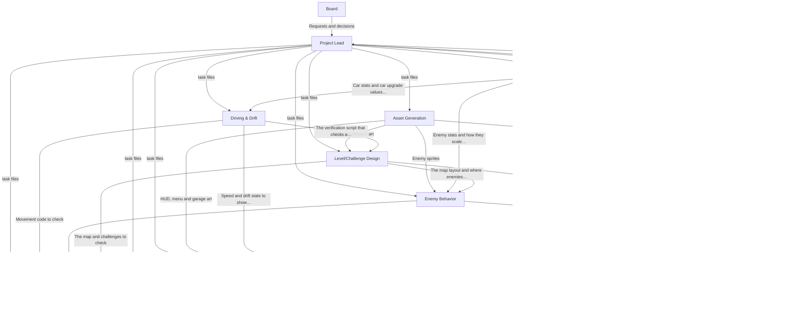
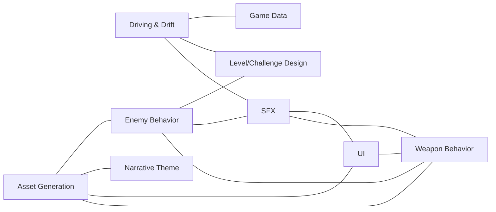

# Agent interactions

An overview of the Solid Carbide agent team: how the agents connect, what each one produces, and why this crew is needed to build the MVP. The board (the game's designer) talks to the Project Lead, which splits requests into task files for the other agents. The task workflow itself is described in `CLAUDE.md` and `tasks/README.md`.

The other files in this folder are each agent's own working copy of its relationships. This file is the shared overview.

## 1. How the agents connect

**How agents actually communicate.** The diagrams show how each agent's work depends on the others, not conversations between them. In this project, every piece of work goes through the Project Lead: it starts each agent with a task file, collects the result, and relays any question between agents or to the board. A background agent cannot ask the board anything directly. Agents also share information through the repo: they read each other's code, data and documents, and each other's task files and result notes.

- **Hands work to:** one agent's output becomes another agent's input. The work travels through the repo, and the Project Lead schedules it with task files.
- **Collaborates with:** two agents' work has to fit together. In practice that happens through linked task files from the same request, agents reading each other's work, and questions relayed by the Project Lead.

Claude Code does let agents message each other directly (with `SendMessage`, if the other agent was started with a name), start agents of their own, or work as an experimental "agent team" with a shared task list. This project deliberately does not use these. Routing everything through the Project Lead keeps an official record of all work in task files, keeps game ideas coming only from the board, and lets the Project Lead set acceptance criteria before work starts. The board decided this on 2026-10-04 and may revisit it, for example when two collaborating agents first need to settle details together.

The diagrams and tables below are generated from the agents' **working copies** (`agent-notes/<agent>.md`), which reflect how the agents actually work. The original relationships in the agent definitions (`.claude/agents/`) may differ. The relationships are guidelines, not strict rules.

Do not edit the generated part by hand. After changing a working copy, regenerate it from the repo root:

```
python tools/generate_agent_diagrams.py           # rewrite the generated part
python tools/generate_agent_diagrams.py --check   # exit 1 if it is out of date
```

The script also lists any relationship it cannot match to a known role (exit code 3), so nothing is dropped silently. In the hand-offs table, "Listed by" shows whether both agents list the hand-off or only one of them, which is where working copies have started to differ.

<!-- BEGIN GENERATED: agent diagrams (tools/generate_agent_diagrams.py) -->

### Hand-offs

Who sends work to whom, and what.



| From | To | What | Listed by |
|---|---|---|---|
| Board | Project Lead | Requests and decisions, in plain conversation. | Project Lead only |
| Project Lead | Asset Generation | Task files for which art to generate. | both |
| Project Lead | Driving & Drift | Task files for car movement, starting with the minimal drift prototype. | both |
| Project Lead | Enemy Behavior | Task files for enemy spawning, movement and scaling. | both |
| Project Lead | Game Data | Task files for stats and upgrade paths. | both |
| Project Lead | Level/Challenge Design | Task files for the map and its challenges. | both |
| Project Lead | Narrative Theme | Task files for story text to write or review. | both |
| Project Lead | QA/Integration | Task files for what to check before a playtest. | both |
| Project Lead | SFX | Task files for sound effects to find and integrate. | both |
| Project Lead | UI | Task files for the HUD, menus and garage screen. | both |
| Project Lead | Weapon Behavior | Task files for how weapons fire and behave. | both |
| Asset Generation | Enemy Behavior | Enemy sprites, which replace the placeholders. | both |
| Asset Generation | Level/Challenge Design | Map and obstacle art. | both |
| Asset Generation | UI | HUD, menu and garage art, which replaces the placeholders. | both |
| Asset Generation | Weapon Behavior | Weapon and projectile art, which replaces the placeholders. | both |
| Driving & Drift | Level/Challenge Design | The verification script that checks a challenge design is achievable with the driving mechanics. | both |
| Driving & Drift | QA/Integration | Movement code to check. | both |
| Driving & Drift | UI | Speed and drift state to show on the HUD. | both |
| Enemy Behavior | QA/Integration | Enemy code to check. | both |
| Enemy Behavior | Weapon Behavior | Enemy positions and health for weapons to target. | both |
| Game Data | Driving & Drift | Car stats and car upgrade values that the drift code reads. | both |
| Game Data | Enemy Behavior | Enemy stats and how they scale over a run. | both |
| Game Data | UI | The numbers the garage and weapon menus display. | both |
| Game Data | Weapon Behavior | Weapon stats and upgrade paths. | both |
| Level/Challenge Design | Enemy Behavior | The map layout and where enemies can spawn. | both |
| Level/Challenge Design | QA/Integration | The map and challenges to check. | both |
| Level/Challenge Design | UI | Challenge positions, for the arrow that points to the next one. | both |
| Narrative Theme | UI | Menu, weapon and gift pack text. | both |
| QA/Integration | Project Lead | A pass or fail for each acceptance criterion, written on the task file. | both |
| SFX | QA/Integration | Sound integration to check. | both |
| UI | QA/Integration | Screens and HUD to check. | both |
| Weapon Behavior | QA/Integration | Weapon code to check. | both |
| Weapon Behavior | UI | The weapon choices for the menu that opens after a challenge. | both |

### Collaborations

Agents that shape each other's work, in both directions.



| Agents | What | Listed by |
|---|---|---|
| Asset Generation and Enemy Behavior | Both get linked task files from the same request. The enemy work starts with a placeholder and doesn't wait for the art. | both |
| Asset Generation and Narrative Theme | The art has to match the story's look and themes. | both |
| Asset Generation and UI | Both get linked task files from the same request. The screen work starts with a placeholder and doesn't wait for the art. | both |
| Asset Generation and Weapon Behavior | Both get linked task files from the same request. The weapon work starts with a placeholder and doesn't wait for the art. | both |
| Driving & Drift and Game Data | The values behind the drift settings and car upgrades are tuned together. | both |
| Driving & Drift and Level/Challenge Design | Challenges have to be drivable with the chosen drift, so they tune obstacle spacing and track width together. | both |
| Driving & Drift and SFX | Drift sounds need to follow how the drift actually behaves. | both |
| Enemy Behavior and Level/Challenge Design | Where enemies spawn depends on the map layout, so each adjusts to the other. | both |
| Enemy Behavior and SFX | Each enemy gets the right sounds for how it moves and attacks. | both |
| Enemy Behavior and Weapon Behavior | Weapon damage and enemy health and speed have to be balanced against each other. | both |
| SFX and UI | Music is associated with screens, such as the menu or the garage, and UI sounds go with the interface. | both |
| SFX and Weapon Behavior | Firing and impact sounds match how each weapon behaves. | both |
| UI and Weapon Behavior | How the weapon menu looks and what each choice shows. | both |

<!-- END GENERATED: agent diagrams -->

## 2. What each agent produces for Solid Carbide

Game details are not repeated here. Each entry points to the document that holds them.

| Role | Produces | Game details in |
|---|---|---|
| **Project Lead** | Task files with acceptance criteria, the timeline record, the GDDs and separate documents kept in sync, and a suggested priority order for the board. Writes no game code or assets. | All documents in `docs/`, `docs/timeline.md` |
| **Driving & Drift** | The Godot code for the car's driving and drift, the drift prototype with tuning sliders for the board's playtests, and the script that checks a challenge design is drivable. | `docs/drifting.md` |
| **Enemy Behavior** | The Godot code for enemies and the boss: spawning, movement, attacks, scaling over a run, coin drops, and the boss's vulnerability window. | `docs/enemies.md` |
| **Weapon Behavior** | The Godot code for how each weapon fires and behaves, including its upgrades in code. Builds weapons; does not design them. | `docs/weapons.md` |
| **Game Data** | Stats and upgrade paths as JSON for weapons, enemies and garage car upgrades, the balancing of those numbers, and saving and loading progress between runs. | `docs/weapons.md`, `docs/enemies.md`, `docs/garage-design.md` |
| **Level/Challenge Design** | The map and its driving challenges, each checked as drivable with the Driving & Drift verification script before hand-over. | `docs/level-design.md` |
| **UI** | The HUD, menus and garage screen. Displays screens and collects input only; the logic behind an action belongs to the agent that owns the thing being changed. | `docs/hud-and-menus.md`, `docs/garage-design.md`, `docs/visual-style.md` |
| **Asset Generation** | Pixel art generated through PixelLab, with a record of every asset (prompt, settings, sources, cost). Creates assets but never judges them. | `docs/visual-style.md`, `docs/extended-narrative.md` |
| **SFX** | Sound effects downloaded from Freesound, with source and license metadata next to each, and direction for where sounds and music play. Music is made by a human musician. | `docs/unfiled-game-details.md` (sound licenses) |
| **Narrative Theme** | Reviews of text and story content for consistency with the story, and new text only when the board asks for it. | `docs/extended-narrative.md` |
| **QA/Integration** | A pass or fail for each acceptance criterion on every task, the project's test tooling, and a full test-suite run before each playtest. | `docs/game-loop-architecture.md` |

## 3. Why this crew is needed for the MVP

The MVP is the game defined by the game area docs in `docs/` (condensed in `docs/long-gdd.md`). It was first scoped by the original Final GDD PDF, which is now historical and no longer a source of truth. The scope is one car, one map, one minion enemy type plus the kaiju, 3 driving-challenge types and 2 weapons (the gun and the exhaust flamethrower), with 8-minute runs and the kaiju arriving at the 7-minute mark. Each part of that game has one agent that builds it:

| MVP part | Built by |
|---|---|
| The car and its drift, the one core skill everything rests on ("Drift Feel is King") | Driving & Drift |
| Minions that swarm the player and grow in number and toughness, coin drops, and the kaiju with its vulnerability window | Enemy Behavior |
| 3 auto-firing, car-inspired weapons that reset every run | Weapon Behavior |
| Weapon upgrade values, enemy scaling, garage upgrade prices and effects, and coins kept between runs | Game Data |
| The one map and the 3 driving-challenge types, including the challenges that open the kaiju's vulnerability window | Level/Challenge Design |
| The HUD (including the arrow to the next challenge), the weapon menu after a challenge, and the garage screen | UI |
| Neon cyberpunk isometric pixel art for the car, enemies, kaiju, map and screens | Asset Generation |
| Drift, weapon, impact and UI sounds | SFX |
| Weapon names, gift pack lines and menu text that fit the Crash City, Stunt Driver and Redgull story | Narrative Theme |
| Everything running together before each playtest | QA/Integration |
| Turning the board's requests into scoped tasks, and keeping the documents in sync | Project Lead |

Remove any one of these agents and a part of the MVP has no builder. None of them goes beyond the GDD's limits: there is one car, one map and no trick system, so no agent exists for unlockable cars, more levels or tricks. Those are named in the documents only as future scope.

**The output can only be as good as the documents.** Agents build the board's ideas and never invent game content, so every gap in the documents is a gap in what the agents can build. Today, most separate documents have decisions recorded but no written content yet ("To be written"), and some are empty:

- **Empty:** Visual style, Game loop architecture. The Asset Generation Agent cannot produce consistent art until the Visual style document is written.
- **Open questions that block an MVP part:** the 3 weapons and their targeting rules (Weapons), the 3 driving-challenge types and how they are placed (Level design), what the garage screen shows (Garage design), how enemy pressure scales before the boss (Enemies), and the drift curve, which only the board's playtests can settle (Drifting).
- **Not yet generated:** the long GDD, which condenses the separate documents.

Filling these in, starting with the drift (the first priority), is what turns this crew from ready into productive.
