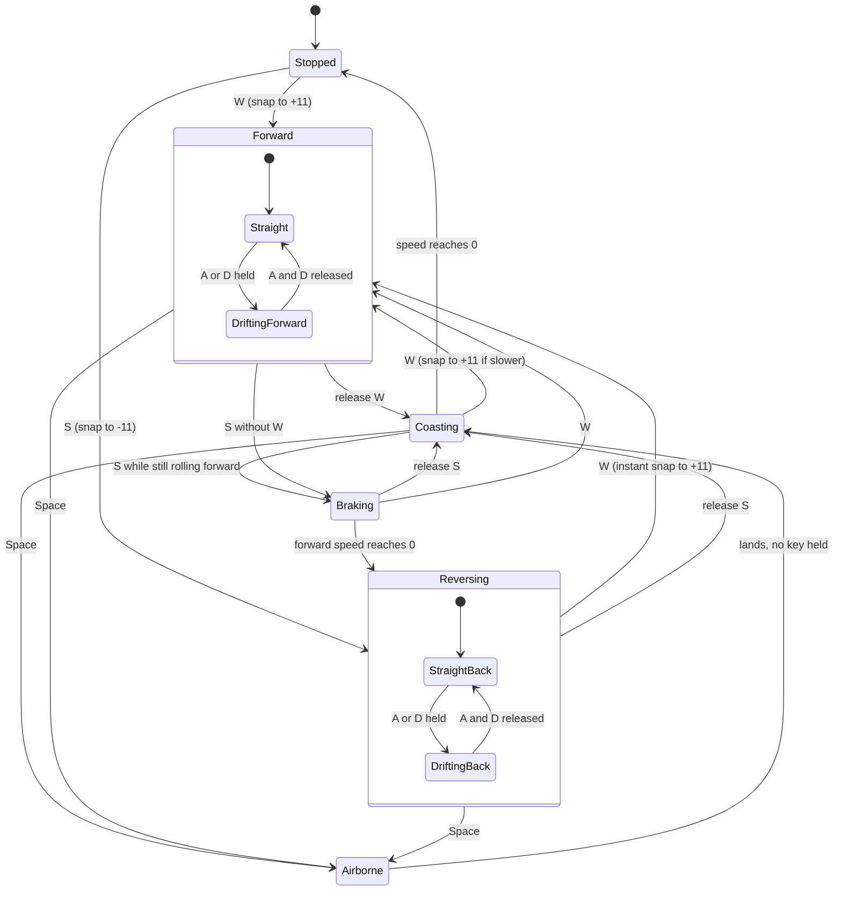
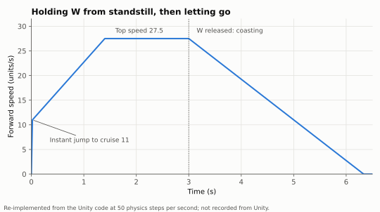
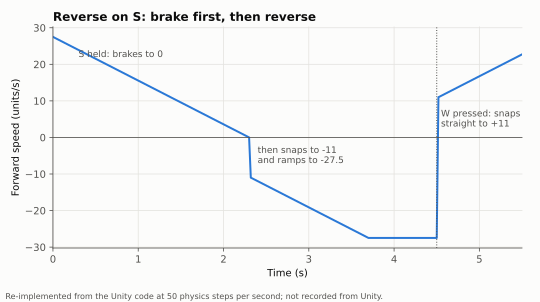
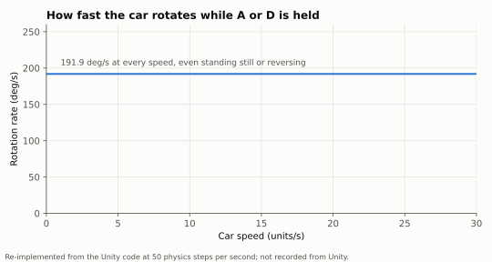
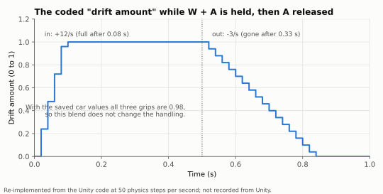
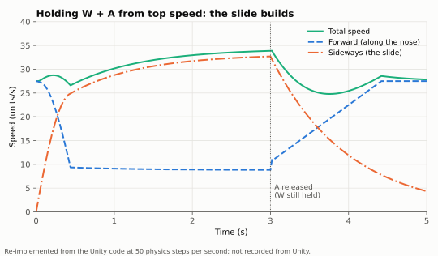
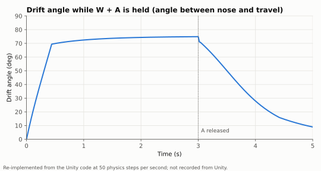
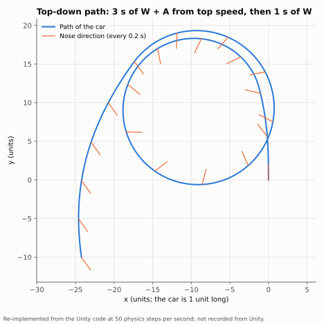

# Unity prototype report: driving, drifting and reverse

Task T-006, by the Driving & Drift Agent. This report describes how the car moves in the board's Unity prototype (`C:\Users\andre\drift-to-survive`, Unity 6000.3.10f1, product name `SolidCarbide`, project name DriftSurvivors, commit `126e7ec`), and what porting it to Godot 4.6 involves. It describes the prototype as it is: it proposes no changes. Paths in this report without a folder prefix are inside the Unity project.

## 1. Summary

The prototype is a **top-down 2D car on Unity's 2D physics (Box2D)**. The car code does not push the car with forces. On every physics step (50 per second) it **sets the car's velocity directly**, split into two parts: speed along the nose ("forward") and speed across the nose ("sideways").

**Driving.** Pressing W makes the car jump **instantly** to a cruise speed of 11 units per second (the car is 1 unit long), then speed climbs steadily to a top speed of 27.5 in about 1.4 seconds. Letting go coasts the car down steadily, from top speed to a stop in about 3.3 seconds. There is no gradual pick-up from standstill and no top-speed wobble: the speed graph is made of straight lines.

**Steering.** A and D rotate the car at a **fixed 191.9 degrees per second, whatever the speed**: at a standstill, while reversing, even in the air during a jump. Steering does not bend the car's path directly. It only turns the body.

**Drifting.** What makes the drift is how the sideways part of the velocity is treated. Forward speed is re-set by the engine every step, but **sideways speed is only reduced by 2% per step** (0.98 kept, which is 36% kept after one second). When you turn, the speed you had becomes partly sideways relative to the new nose direction, and it lingers. Held W + A or W + D makes the slide build up fast: the angle between the nose and the direction of travel passes 45 degrees after about 0.3 seconds and settles near 75 degrees, with the car carried mostly sideways at about 34 units per second, slightly faster than its straight-line top speed, in a circle about 20 units across. Release A or D with W still held and the car straightens out as the slide fades over the next second or two and the engine pulls it back to top speed: the "180 while accelerating and zooming back out" the board describes in the prototype's own notes (`docs/ideas.md`, "Current feel notes").

The code also has a separate **"drift amount"** that ramps from 0 to 1 in 0.08 seconds while a drive key and a steer key are held, and back to 0 in 0.33 seconds after. It is meant to blend between normal grip and drift grip, but in the car's current data all three grip values are the same (0.98), so **it changes nothing in the handling**. It does switch on the drift effects (tire tracks, smoke, the flame exhaust weapon, trick score). Section 4 covers both and what this means for "the drift curve".

**Reverse.** S while moving forward **brakes** steadily (top speed to zero in 2.3 seconds). At zero it **snaps** to reverse cruise (11 backwards), then speeds up to 27.5 backwards, mirroring W. W always wins: pressing W while reversing snaps the car straight to 11 forwards.

**Camera.** A plain top-down orthographic camera that sits exactly on the car every frame (no smoothing, no look-ahead, no rotation). Its zoom is the "Camera zoom" setting in the pause menu, saved in the registry (default 14.4, which shows 28.8 units from top to bottom of the screen).

What makes it feel the way it does, in short: instant cruise speed, constant and very fast rotation, and a sideways slide that barely decays, so speed is carried through turns as a big, sweeping drift.

## 2. Controls

The car reads the keyboard and gamepad **directly** in `Assets/Scripts/Player/PlayerCarController.cs`. It does **not** use the input actions asset `Assets/InputSystem_Actions.inputactions`. That asset (and its copy in `Assets/Resources/`) is used only by the menus. Its `Player` map binds `Move` to WASD, the arrow keys and the left stick, `Jump` to Space and gamepad South, and more, but nothing in the car code reads those actions.

| Input | Keyboard | Gamepad | What it does | Code |
|---|---|---|---|---|
| Accelerate | W | Right trigger past 0.2 | Forward drive. On/off only: a light trigger press counts as full | `GetAccelerateInput`, lines 237-251 |
| Brake / reverse | S | Left trigger past 0.2 | Brakes while moving forward, then reverses. Ignored while W (or RT) is held | `GetReverseInput`, lines 254-271 |
| Steer left | A | Left stick left (dead zone 0.15) | Rotates the car counter-clockwise. Stick is analog: half tilt = half rotation rate | `GetSteerInput`, lines 274-303 |
| Steer right | D | Left stick right | Rotates the car clockwise. A + D together cancel out | same |
| Jump (test feature) | Space | South button (A / Cross) | A short hop using a pretend height. In the air: no drive or brake, steering still rotates the car, velocity carries on unchanged | `GetJumpPressedThisFrame`, lines 305-320; `PlayerElevation.cs` |
| Pause | Escape | Start | Opens the pause menu (camera zoom and drift aim line live in its settings) | `Assets/Scripts/UI/PauseUI.cs`, lines 201-205 |

The arrow keys do **not** steer, although the prototype's README says they do (open question 6).

**Switching between forward, braking and reverse on S** (`ApplyMovementAndDrift`, lines 341-373). Each physics step the code looks at the forward speed (speed along the nose; negative means going backwards):

- **W held:** below cruise (including reversing) it jumps to +11; at or above cruise it climbs towards +27.5.
- **S held, W not held:** moving forward (above 0) it brakes towards 0; at 0 or slower than -11 backwards it jumps to -11; beyond that it climbs towards -27.5.
- **Neither:** it coasts towards 0.

With one player (the board's saved setting, `GameSession.PlayerCount` = 1) the car accepts the keyboard and any gamepad at the same time.

## 3. States

The code has no explicit state machine. The states below are the branches the code takes each physics step. "Drifting" (`IsDrifting`, line 44) is any moment when a drive key (W or S) and a steer key are held together; it overlaps driving forward and reversing.



Notes on the diagram:

- **Steering works in every state**, including Stopped (the car spins on the spot) and Airborne.
- "Drifting" changes the drift amount and turns on the drift effects. It does not change the physics with the current car data (section 4).
- **Airborne** (jump): drive and brake keys are ignored, so the velocity is left untouched (no coasting, no sideways decay) while steering still rotates the body. On landing the next step treats whatever keys are held as usual.

## 4. How it works, step by step

**2D or 3D:** 2D. The car is a `Rigidbody2D` (dynamic, mass 1, gravity scale 0, linear damping 0, angular damping 0.05, continuous collision detection, no interpolation) with a 1 x 1 unit `BoxCollider2D` and no physics material (Box2D's default friction 0.4, no bounce). The physics rate is Unity's fixed timestep, **0.02 s = 50 steps per second** (`ProjectSettings/TimeManager.asset`). World gravity is (0, -9.81) but the car ignores it (gravity scale 0).

**Engine features it relies on:** direct velocity writes (`Rigidbody2D.linearVelocity`), `Rigidbody2D.MoveRotation` for steering, and Box2D's linear damping (only on the Isometric stage off-road, below). No forces, no torque, no friction-based tyre model. Collisions with walls and enemies are left to Box2D.

Each physics step (`FixedUpdate`, lines 158-183), with `dt` = 0.02 s, the values from section 5, and the car on the ground:

**Step 1. Read input.** `W`, `S` (ignored if W is held), `steer` = +1 for A, -1 for D, 0 for none (analog on the stick).

**Step 2. Update the drift amount** (lines 185-191).

```
drifting = (W or S) and |steer| > 0.01
driftAmount = MoveTowards(driftAmount, drifting ? 1 : 0, (drifting ? enterRate : exitRate) * dt)
```

Plain language: a 0-to-1 dial that rises by 12 per second (0.24 per step) while you drive and steer, and falls by 3 per second (0.06 per step) when you stop. `MoveTowards` moves a value towards a target by at most the given amount, without overshooting.

**Step 3. Steer** (lines 333-338).

```
angle = angle + steer * turnSpeed * steerSensitivity * dt      // 202 * 0.95 = 191.9 deg/s = 3.838 deg per step
```

Plain language: the body rotates at a fixed rate. Speed plays no part. `MoveRotation` only applies the new angle during the physics step that follows, so the velocity in step 4 is still built on the heading from the start of this step: the velocity lags the body by one step.

**Step 4. Split the current velocity** into forward (along the nose, `transform.up`) and sideways (along `transform.right`):

```
forward  = dot(velocity, noseDirection)
sideways = dot(velocity, rightDirection)
```

**Step 5. New forward speed** (lines 349-370), with `cruise` = 11, `top` = cruise * 2.5 = 27.5, `ramp` = top / 2.3 * dt = 0.2391 per step (11.96 units/s per second), `coast` = top * 0.3 * dt = 0.165 per step (8.25 units/s per second):

```
if W:      forward = (forward < cruise) ? cruise : MoveTowards(forward, top, ramp)
else if S: if forward > 0:            forward = MoveTowards(forward, 0, ramp)       // brake
           else if forward > -cruise: forward = -cruise                              // snap to reverse
           else:                      forward = MoveTowards(forward, -top, ramp)
else:      forward = MoveTowards(forward, 0, coast)
```

Plain language: the engine sets forward speed outright. Braking uses the same rate as speeding up. "Time to top speed" (2.3 s) is the time a full 0-to-27.5 climb would take at that rate, but because the first 11 is skipped by the snap, cruise to top actually takes 1.38 s (69 steps).

**Step 6. Sideways grip** (lines 375-381).

```
speed01      = clamp01(|forward| / driftSpeedReference)                  // 20
gripAtSpeed  = lerp(driftGripLowSpeed, driftGripHighSpeed, speed01)       // 0.98, 0.98
grip         = lerp(driftFactor, gripAtSpeed, driftAmount)                // 0.98 .. 0.98
sideways     = sideways * grip
```

Plain language: a fraction of the sideways speed is kept each step. With the current data every term is 0.98, so `grip` is always 0.98: 2% of the slide is lost per step, 64% per second (half of it gone after about 0.69 s).

**Step 7. Write the velocity back** (line 372): `velocity = noseDirection * forward + rightDirection * sideways`.

**Step 8. Box2D's step** applies damping and moves the car: `velocity = velocity / (1 + dt * linearDamping)`, then the angle from step 3, then `position += velocity * dt`, then collisions. Linear damping is 0 except on the **Isometric stage**, where `TilemapGroundDrag` sets it to 2 whenever the car is off the road tiles (`Assets/Scripts/Player/TilemapGroundDrag.cs`, lines 42-91). That removes about 3.8% of all speed per step. On the Grass stage the component has no tilemap assigned and does nothing.

### The drift curve

The board decided Solid Carbide uses "the drift curve the Unity prototype uses" (Drifting, Decisions). In the code, two different things could be called that, and they behave differently.

**(a) The coded drift amount: a straight-line ramp.**

```
driftAmount(t) = min(1, 12 * t)          while W or S + A or D are held     (full after 0.083 s, 5 steps)
driftAmount(t) = max(0, 1 - 3 * t)       after letting go                   (gone after 0.333 s, 17 steps)
```

Shape: linear up, linear down, steeper going in than coming out. It feeds the grip blend in step 6, but with the current data (all three grips 0.98) the blend gives 0.98 whatever its value. Today it only drives the effects and score. Chart: [drift amount](drift-amount.svg).

**(b) The drift the player actually feels: the slide builds as a saturating exponential.** While a turn is held, each step turns the body by d = 3.838 degrees and keeps a fraction g = 0.98 of the sideways speed. The sideways speed follows

```
sideways(n+1) = g * (sideways(n) * cos d + forward * sin d)
```

so it climbs towards a ceiling and approaches it like 1 - r^n, with r = g * cos d = 0.9778 per step:

```
sideways(t) ≈ S * (1 - 0.9778^(t / 0.02)) ≈ S * (1 - e^(-t / 0.89 s))
S = g * forward * sin d / (1 - g * cos d) = 2.955 * forward       // 32.5 when forward is the 11 cruise
```

Shape: a fast rise that levels off, like a capacitor charging. Starting from top speed the angle builds even faster, because the sliding speed bleeds the forward speed down to cruise first: the drift angle passes 45 degrees at about 0.28 s, 60 degrees at 0.38 s and 70 degrees at 0.52 s, then creeps towards about 75 degrees. Total speed rises from 27.5 to about 33.9. Charts: [drift speeds](drift-build-speeds.svg), [drift angle](drift-angle.svg), [top-down path](drift-path.svg).

Which of the two the board means is open question 1. The Godot version should copy the code exactly, drift amount included, so both behaviours carry over whichever is meant, and the grip blend stays available to tune.

## 5. Every tuning value

**Where the values come from.** Since commit `122ef42` ("Centralise driving variables", 2026-04-30) the car's handling comes from the car's data asset `Assets/Data/Vehicles/Vehicle_Default.asset`. `PlayerStats` reads it and `PlayerCarController` reads `PlayerStats`. Every stage scene (`Stage_Grass.unity`, `Stage_Isometric.unity`, `MainScene.unity`) assigns this asset to the player's `PlayerStats`, so the asset's values override the defaults written in `VehicleData.cs`. The fallbacks in `PlayerCarController.cs` (lines 16, 19, 105-114) and `PlayerStats.cs` (lines 83-99) are never used, because `PlayerStats` and its asset are present.

**Saved values in the registry.** Before that commit four driving values were pause-menu sliders saved in PlayerPrefs. The current code **no longer reads any driving value from the registry**. The only saved values that still affect the car or camera are `CameraZoom` (camera) and `Driving.ShowDriftLaunchIndicator` (the aim line, a visual aid). `FriendBuildPauseTuning.ApplyLockedTuning()` runs on every launch, but it writes only spawn, elite, inventory, cheat and level-up keys, never driving or camera keys (`Assets/Scripts/Systems/FriendBuildPauseTuning.cs`, lines 27-58). Locations read (with `reg query` only):

- **Built game:** `HKCU\Software\DefaultCompany\SolidCarbide`
- **Editor:** `HKCU\Software\Unity\UnityEditor\DefaultCompany\SolidCarbide`
- Also present: `HKCU\Software\Unity\UnityEditor\DefaultCompany\DriftSurvivors`, from before the product was renamed. The current game does not read it.

**A limit of `reg query`.** Unity stores each float as an 8-byte value inside a `REG_DWORD` entry, and `reg query` prints only the lower 4 bytes, so float values cannot be read exactly with it. The lower 4 bytes do let a value be checked against a candidate. Check: `EliteTuning.HpMultiplier`, which the launch code sets to 10.6, shows `0x40000000` under the built-game key, exactly the lower half of 10.6 stored this way, and `SpawnTuning.IntervalMultiplier` (set to 0.95) shows `0x60000000`, also a match. Integers (for example `SpawnTuning.MaxEnemies` = `0x5a` = 90) are shown in full.

| Parameter | Default in script | Value in project files (used) | Saved value (registry) | Game uses | Unit | What it does | Where set |
|---|---|---|---|---|---|---|---|
| Cruise speed (`forwardSpeed`) | 11 | **11** | none | project file | units/s | Speed W snaps to instantly; base for top speed | `Assets/Data/Vehicles/Vehicle_Default.asset` line 15 (script default `Assets/Scripts/Vehicle/VehicleData.cs` line 13) |
| Turn speed (`turnSpeed`) | 259 | **202** | none | project file | deg/s | Body rotation rate before the sensitivity multiplier | `Vehicle_Default.asset` line 16 (`VehicleData.cs` line 16) |
| Top speed multiplier (`topSpeedMultiplier`) | 2.5 | **2.5** | Legacy `Driving.TopSpeedMultiplier_h38702501`: built `0x0`, editor `0x0` (lower half matches 2.5). Not read | project file | x cruise | Top speed = 11 x 2.5 = 27.5 | `Vehicle_Default.asset` line 17 (`VehicleData.cs` line 20) |
| Time to top speed (`timeToTopSpeedSeconds`) | 2.3 | **2.3** | Legacy `Driving.TimeToTopSpeedSeconds_h811639555`: built `0x60000000`, editor `0x60000000` (matches 2.3). Not read | project file | s | Sets the ramp rate 27.5 / 2.3 = 11.96 units/s per second, used for speeding up, braking and reverse | `Vehicle_Default.asset` line 18 (`VehicleData.cs` line 23) |
| Coast slowdown (`coastDecelerationMultiplier`) | 0.3 | **0.3** | Legacy `Driving.CoastDecelerationMultiplier_h559516706`: built `0x40000000`, editor `0x40000000` (matches 0.3). Not read | project file | x top speed per s | Coasting loses 27.5 x 0.3 = 8.25 units/s per second | `Vehicle_Default.asset` line 19 (`VehicleData.cs` line 26) |
| Steering sensitivity (`steerSensitivityMultiplier`) | 0.95 | **0.95** | Legacy `Driving.SteerSensitivityMultiplier_h1948986449`: built `0x60000000`, editor `0x60000000` (matches 0.95). Not read | project file | x turn speed | Rotation rate = 202 x 0.95 = 191.9 deg/s | `Vehicle_Default.asset` line 20 (`VehicleData.cs` line 29) |
| Base sideways grip (`driftFactor`) | 1.2 (clamped to 1) | **0.98** | none | project file | fraction kept per step | Sideways speed kept per step when not drifting | `Vehicle_Default.asset` line 21 (`VehicleData.cs` line 33; clamp `PlayerStats.cs` line 102) |
| Drift grip, low speed (`driftGripLowSpeed`) | 1.2 (clamped to 1) | **0.98** | none | project file | fraction kept per step | Sideways speed kept per step while fully drifting, at low speed | `Vehicle_Default.asset` line 22 (`VehicleData.cs` line 37) |
| Drift grip, high speed (`driftGripHighSpeed`) | 1.2 (clamped to 1) | **0.98** | none | project file | fraction kept per step | Same, at or above the reference speed | `Vehicle_Default.asset` line 23 (`VehicleData.cs` line 41) |
| Drift speed reference (`driftSpeedReference`) | 20 | **20** | none | project file | units/s | Forward speed where high-speed drift grip fully applies | `Vehicle_Default.asset` line 24 (`VehicleData.cs` line 44) |
| Drift enter rate (`driftEnterRate`) | 12 | **12** | none | project file | per s | How fast the drift amount rises to 1 | `Vehicle_Default.asset` line 25 (`VehicleData.cs` line 47) |
| Drift exit rate (`driftExitRate`) | 12 | **3** | none | project file | per s | How fast the drift amount falls to 0 | `Vehicle_Default.asset` line 26 (`VehicleData.cs` line 50) |
| — | — | — | Legacy `Driving.DriftRetentionScale_h62273795` (editor `0x0`), `Driving.RotateCameraWithPlayer_h306643699` (editor `1`), `Driving.RoadSpeedBoostPercent_h3504092995` (old DriftSurvivors key `0x0`) | not read | — | Keys from older versions; no current code reads them | registry only |
| Physics rate | — | **0.02 s (50 Hz)** | none | project file | s | Length of one physics step; every per-step number in section 4 depends on it | `ProjectSettings/TimeManager.asset` line 6 |
| Linear damping | — | **0** | none | project file | per s | Box2D speed loss; 0 means none | `Assets/Scenes/Stage_Grass.unity` line 75320, `Stage_Isometric.unity` line 167836, `MainScene.unity` line 447 (`m_LinearDamping`) |
| Off-road extra damping (`offRoadDrag`) | 2 | **2** (active on Isometric only) | none | project file | per s | Added to linear damping off the road tiles. Grass stage: no tilemap assigned, so no effect | `Assets/Scripts/Player/TilemapGroundDrag.cs` line 24; `Stage_Isometric.unity` line 167927 (tilemap line 167921); `Stage_Grass.unity` line 75410 (tilemaps empty, lines 75405-75406) |
| Angular damping | — | **0.05** | none | project file | per s | Only matters for spin from collisions; steering sets the angle directly | `Stage_Grass.unity` line 75321 (`m_AngularDamping`) |
| Mass, gravity scale, collider | — | **1, 0, 1 x 1 units** | none | project file | kg, -, units | Car body; gravity off | `Stage_Grass.unity` lines 75319, 75322, 75305 |
| Interpolation, collision detection | — | **off, continuous** | none | project file | — | No smoothing between physics steps | `Stage_Grass.unity` lines 75330, 75332 |
| Trigger threshold | — | **0.2** | none | code | 0-1 | How far RT / LT must be pressed to count | `PlayerCarController.cs` lines 242, 262 |
| Stick dead zone | — | **0.15** | none | code | 0-1 | Left stick X ignored below this | `PlayerCarController.cs` line 287 |
| Drift steer threshold | — | **0.01** | none | code | 0-1 | Steering must exceed this to count as drifting | `PlayerCarController.cs` line 187 |
| Jump height / jump gravity | 1.2 / 18 | **1.2 / 18** | none | project file | height units, per s² | Test jump: about 0.73 s in the air | `Stage_Grass.unity` lines 75486-75487 (`Assets/Scripts/Player/PlayerElevation.cs` lines 11, 14) |
| Camera zoom (orthographic size) | 14.4 (slider 6-20) | 12 in the scenes, replaced at start by the saved value | `CameraZoom_h3219581099`: built `0x20000000`, editor `0x0` (lower halves only; exact value not readable with `reg query`). The built value is **not** 14.4 (that would show `0xC0000000`) and not 12 | **saved value** | units (half the screen height) | How much of the world is visible | `Assets/Scripts/UI/PauseUI.cs` lines 103-109, 173, 1827-1835; scene `orthographic size` `Stage_Grass.unity` line 76683; `SplitScreenManager` `orthoSize` line 76622 |
| Camera follow mode (`snapToTarget`) | on | **on** | none | project file | — | Camera sits exactly on the car | `Stage_Grass.unity` line 76638 (`Assets/Scripts/Systems/CameraFollow.cs` line 20) |
| Camera follow speed (`followSpeed`) | 8 | **8** (unused while snapping) | none | project file | per s | Only used if snapping is off | `Stage_Grass.unity` line 76637 |
| Camera offset | 0 | **(0, 0, 0)** | none | project file | units | No framing offset or look-ahead | `Stage_Grass.unity` line 76639 |
| Drift aim line | off | off | `Driving.ShowDriftLaunchIndicator`: absent under both SolidCarbide keys (so off); `0` under the old DriftSurvivors key | default (off) | on/off | Optional line showing where the car would go if W were released | `Assets/Scripts/Systems/DrivingSettings.cs` lines 8-10; line lengths `PlayerCarController.cs` lines 392-402 |

The line numbers for `Stage_Isometric.unity` match the Grass ones for the same fields (player components at lines 167681-167848, camera at 168054-168115). In-run upgrades also change some of these numbers during a run (a Speed upgrade adds 10% of cruise speed per level, Steering sensitivity adds 20% of turn speed, a Flame Exhaust tier adds 20% of turn speed: `Assets/Scripts/Upgrades/UpgradeApplicator.cs` lines 48-53, `Assets/Scripts/Combat/WeaponTierEffectApplicator.cs` line 164). They are game content outside this report and are not carried over.

## 6. Graphics

All charts come from **re-implementing the formulas in section 4** in `tools/unity_drift_charts.py`, with the values from section 5, at 50 steps per second. They were not recorded from Unity. They show the Grass stage (no damping) and ignore collisions. Run `python tools/unity_drift_charts.py` to redraw them.

**Speed when holding W from standstill, then letting go.** Instant jump to 11, straight climb to 27.5 at 1.4 s, straight coast down to 0 over 3.3 s.



**Reverse speed.** From top speed, S brakes in a straight line to 0 at 2.3 s, snaps to -11, climbs to -27.5. Pressing W then snaps straight to +11.



**Turning rate against speed.** Flat: 191.9 degrees per second at every speed, including 0.



**The coded drift amount.** Linear ramp in (0.08 s) and out (0.33 s). With the current car data it changes nothing in the handling.



**How the slide builds with W + A held from top speed.** Sideways speed rises quickly and levels off near 33. Forward speed falls to cruise. Total speed rises slightly. After A is released (W still held) the slide fades and forward speed climbs back to top speed.



**Drift angle** (angle between the nose and the direction of travel) during the same manoeuvre.



**Top-down path** of the same manoeuvre, with the nose direction drawn every 0.2 s. The car (1 unit long) circles about 20 units across, nose pointing well inside the circle.



## 7. Camera

**How it follows.** `CameraFollow` (`Assets/Scripts/Systems/CameraFollow.cs`) runs after every rendered frame (`LateUpdate`) and puts the camera exactly at the car's position (`snapToTarget` = on, `Stage_Grass.unity` line 76638), keeping its own depth (z = -20). There is **no smoothing** (`followSpeed` 8 is only used when snapping is off), **no look-ahead** and **no offset** (`offset` = 0, line 76639). The car's physics body has interpolation off, so the car moves in 50 Hz steps and the camera moves with it: on a screen faster than 50 Hz, the car stays still on screen while the world shifts in small steps.

**Rotation.** The camera **never rotates**: it stays north-up while the car turns (camera rotation is identity in the scene and no code changes it). An old registry key `Driving.RotateCameraWithPlayer` (editor key, value 1) points to an earlier version that may have rotated the camera; the current code does not read it (open question 8).

**Zoom.** Orthographic (flat, no perspective). The orthographic size is half the visible height in world units:

| Source | Value | Where |
|---|---|---|
| Scene camera | 12 | `Stage_Grass.unity` line 76683 (`orthographic size`) |
| `SplitScreenManager` sets it at start | 12 | `Stage_Grass.unity` line 76622 (`orthoSize`); script `Assets/Scripts/Systems/SplitScreenManager.cs` line 23 |
| Pause menu "Camera zoom" applies the saved value at start, after the above (whichever starts first, the saved value wins: `PauseUI.Start` calls `SplitScreenManager.SetOrthoSize`) | saved `CameraZoom`, default **14.4**, slider 6 to 20 | `Assets/Scripts/UI/PauseUI.cs` lines 103-109, 173, 1827-1835 |
| Board's saved value | built game: not 14.4 and not 12, exact value unreadable with `reg query` (`0x20000000`); editor: unreadable (`0x0`, consistent with 12, 14, 16 or 20, among others) | `HKCU\Software\DefaultCompany\SolidCarbide\CameraZoom_h3219581099`; `HKCU\Software\Unity\UnityEditor\DefaultCompany\SolidCarbide\CameraZoom_h3219581099` |

At the default 14.4 the screen shows 28.8 units from top to bottom (about 29 car lengths), and 51.2 units across on a 16:9 screen. The camera's zoom never changes during play (no speed-based zoom). With one player the camera fills the screen. With 2 to 4 players the screen splits into quarters, one camera each, all with the same zoom.

Things on the car that the camera shows but that are not camera behaviour: the car sprite is picked from 48 pre-drawn directions (7.5 degrees apart, `Assets/Scripts/Player/CarDirectionalSprite.cs`), so the drawn car turns in small steps while the body turns smoothly.

## 8. Porting to Godot 4.6

### Feature by feature

| Unity feature | Closest Godot 4.6 equivalent | What will not carry over exactly |
|---|---|---|
| `Rigidbody2D` (dynamic) with velocity set every step | `CharacterBody2D`, setting `velocity` and calling `move_and_slide()` in `_physics_process`; or `RigidBody2D` setting `linear_velocity` in `_integrate_forces` | Collisions: Box2D resolves them with impulses and friction 0.4, `move_and_slide` slides along walls with no bounce or spin. Enemy pushes would need their own code with `CharacterBody2D`. A `RigidBody2D` is closer for collisions but Godot's 2D physics engine is not Box2D |
| `Rigidbody2D.MoveRotation` | Set `rotation` directly in `_physics_process` | Unity applies the new angle during the physics step, so the velocity lags the body by one step. To match, build the velocity from the heading **before** adding this step's rotation (as the chart script does) |
| `Mathf.MoveTowards`, `Mathf.Lerp`, `Mathf.Clamp01` | `move_toward()`, `lerp()` with `clampf(t, 0, 1)`, `clampf(x, 0, 1)` | Godot's `lerp` does not clamp its weight, so clamp it first |
| Fixed timestep 0.02 s (50 Hz) | Project setting `physics/common/physics_ticks_per_second` (default **60**) | The sideways grip (0.98) and the steering lag are **per step**, not per second. At 60 Hz the same numbers give a grippier car (0.98^60 = 30% kept per second instead of 36%) and a smaller steady drift. Either set the rate to 50, or convert: grip per step at 60 Hz = 0.98^(50/60) = 0.9832. Rates written per second (speeds, ramp, coast, turn, drift enter and exit) carry over as they are. Even converted, the discrete steps give slightly different curves; 50 Hz is the only exact match |
| Linear damping (Box2D: `v = v / (1 + dt * d)`) | `RigidBody2D.linear_damp` with `linear_damp_mode` = Replace | Godot's formula is `v = v * (1 - dt * d)`: at d = 2 and 50 Hz that keeps 0.960 per step instead of 0.9615. Godot also adds a project-wide default damping of 0.1 (`physics/2d/default_linear_damp`) unless the body uses Replace. With `CharacterBody2D` there is no damping, so write the Box2D formula in code |
| Angular damping 0.05 | `RigidBody2D.angular_damp` (project default 1.0) | Only matters for spin from collisions |
| Off-road drag from tilemap tiles (`TilemapGroundDrag`) | `TileMapLayer.local_to_map()` + `get_cell_tile_data()` (or custom tile data marking road) | Same idea; only the Isometric stage used it |
| Units: 1 unit = car length, y up, angles counter-clockwise | Pixels, y down, `rotation` positive = clockwise on screen | Choose a pixels-per-unit scale and multiply every distance and speed by it. Forward was `transform.up`; in Godot use `-transform.y` (sprite drawn nose-up) or `transform.x` (nose-right). A must still turn the car counter-clockwise on screen, which in Godot means **subtracting** from `rotation` |
| Gravity scale 0 | `gravity_scale = 0` on `RigidBody2D`; nothing needed with `CharacterBody2D` | — |
| Input read straight from devices (W, S, A, D, RT, LT, left stick, Space) | `InputMap` actions (for example `accelerate`, `reverse`, `steer_left`, `steer_right`) with keys and joypad bindings | Unity treats the triggers as on/off past 0.2 and the stick as analog past 0.15. Godot actions have their own dead zone per action; set 0.2 and 0.15 and use `Input.get_axis` for steering to keep the analog stick |
| Camera: orthographic, follows in `LateUpdate`, no smoothing, no rotation | `Camera2D` as the car's child or following it in code, `position_smoothing_enabled = false`, `ignore_rotation = true`, `process_callback` = Physics | Zoom works the other way: Godot's `zoom` is a magnification. `zoom = viewport_height_px / (2 * orthographic_size * pixels_per_unit)`. At 14.4 and 1080 px high with 64 px per unit: 1080 / (28.8 x 64) = 0.586. Keep physics interpolation off to match Unity's stepped look, or turn it on for smoother motion (a visible change) |
| Pause-menu zoom saved in PlayerPrefs | `ConfigFile` saved under `user://` | — |
| Jump with pretend height (`PlayerElevation`) | A plain script variable for height; draw offset and shadow | Only if the board wants the jump (open question 5) |

### Proposed settings for the Godot prototype

These are the prototype's own parameters, ready to become sliders. Starting values are the ones the game uses (section 5). Nothing new is added.

| Setting | Start value | Suggested slider range | Plain-language label |
|---|---|---|---|
| Cruise speed | 11 units/s | 4 to 25 | Speed you jump to when you press W |
| Top speed multiplier | 2.5 | 1 to 4 | Top speed as a multiple of cruise speed |
| Time to top speed | 2.3 s | 0.5 to 5 | Bigger = slower climb from cruise to top, and slower braking |
| Coast slowdown | 0.3 | 0 to 1.5 | How fast you slow down with no key held |
| Turn speed | 202 deg/s | 60 to 360 | How fast the car rotates while A or D is held |
| Steering sensitivity | 0.95 | 0.5 to 1.5 | Multiplier on turn speed (the prototype kept both; they could share one slider) |
| Base sideways grip (drift factor) | 0.98 per step | 0.80 to 1.00 | How much of the slide you keep each step when not drifting. Lower = grippier |
| Drift grip, low speed | 0.98 per step | 0.80 to 1.00 | Slide kept per step while drifting slowly |
| Drift grip, high speed | 0.98 per step | 0.80 to 1.00 | Slide kept per step while drifting fast |
| Drift speed reference | 20 units/s | 5 to 40 | Speed at which "high speed" drift grip fully applies |
| Drift enter rate | 12 per s | 1 to 30 | How fast drift grip takes over when you start drifting |
| Drift exit rate | 3 per s | 1 to 30 | How fast normal grip comes back when you stop |
| Off-road damping | 2 per s | 0 to 5 | Extra slowdown off the road (only if the map has road tiles) |
| Camera zoom (orthographic size) | 14.4 units | 6 to 20 | How much of the world you see (half the screen height) |
| Physics rate | 50 Hz | 50 or 60 | Must stay 50 for an exact match; 60 is Godot's default |

The prototype also had an on/off "drift aim line". It could become a toggle if the board wants it.

## 9. Open questions

1. **Which "drift curve" does the board mean?** (a) The coded drift amount, a straight-line ramp that is full in 0.08 s and has no effect on the handling with the current car data, or (b) the slide the player feels, which builds like 1 - e^(-t/0.89 s) towards about 75 degrees (section 4). The Godot port can copy both exactly; the answer matters for which one gets a slider and a name.
2. **Camera zoom value.** The board's saved zoom is the camera default, but `reg query` cannot show the full value: the built game's value is neither 14.4 nor 12. The board can read it off the pause menu slider, or approve a different read-only way to read the registry (for example PowerShell's `Get-ItemProperty`, which reads the full 8 bytes). Until then 14.4 (the code default) is the working value.
3. **Built game or editor?** Both locations hold saved values. For driving it makes no difference (no driving value is read from the registry). It matters for the camera zoom (question 2) and the stage (question 4). `reg query` does not show when a value was written, so the files cannot tell which one the board played with last.
4. **Which stage was the feel judged on?** The built game's saved stage is index 0 and the editor's is index 1. Stages are listed from `Assets/Resources/Stages` (Grass, Isometric, Parking Lot, Parking Lot 2; the parking lots are hidden), so index 0 is most likely Grass and 1 Isometric, but Unity does not guarantee that order. On Isometric, leaving the road adds damping: a straight run off-road cannot go past cruise speed (about 10.6 to 11), and a held drift settles near 15 units/s at about 50 degrees instead of 34 units/s at 75 degrees.
5. **Jump on Space** is in the prototype (marked as a test feature). Carry it over or not?
6. **Arrow keys** do not steer in the prototype even though its README says they do. Should Solid Carbide steer with the arrows?
7. **Gamepad.** The prototype supports a gamepad (on/off triggers, analog stick steering). Carry it over?
8. **Older versions.** Registry keys `Driving.RotateCameraWithPlayer` (editor, on), `Driving.DriftRetentionScale` and `Driving.RoadSpeedBoostPercent` come from older versions that are no longer in the code. The current version has a north-up camera and no road speed boost. Does the board remember the current version's feel, or an older one with, for example, a rotating camera? (The task confirms the current state is the reference.)
9. **Behaviours the board may or may not want to keep** (the decisions say to copy the prototype; listed so nothing surprises anyone): the car rotates on the spot at a standstill; A always turns the nose counter-clockwise, also when reversing (a real car's nose swings the other way); pressing W while reversing at full speed flips instantly to 11 forwards; a held drift is faster (about 34 units/s) than the straight-line top speed (27.5).
10. **Physics rate.** Godot defaults to 60 Hz. Is setting the Godot prototype to 50 Hz acceptable, so the drift matches exactly?
11. **Collisions.** How the car bounces off walls and enemies comes from Box2D, which Godot does not use. Enemy knockback is outside this report. Does the board want collision feel matched in the movement prototype, or later?
12. **One small modelling assumption.** The report assumes `MoveRotation` applies the new angle during the physics step (so the velocity lags the heading by one step), which is how Unity documents it. Without the lag the numbers barely change: total speed is the same (about 33.9) and the drift angle settles near 71 degrees instead of 75. The board's playtest of the Godot version is the real check.
