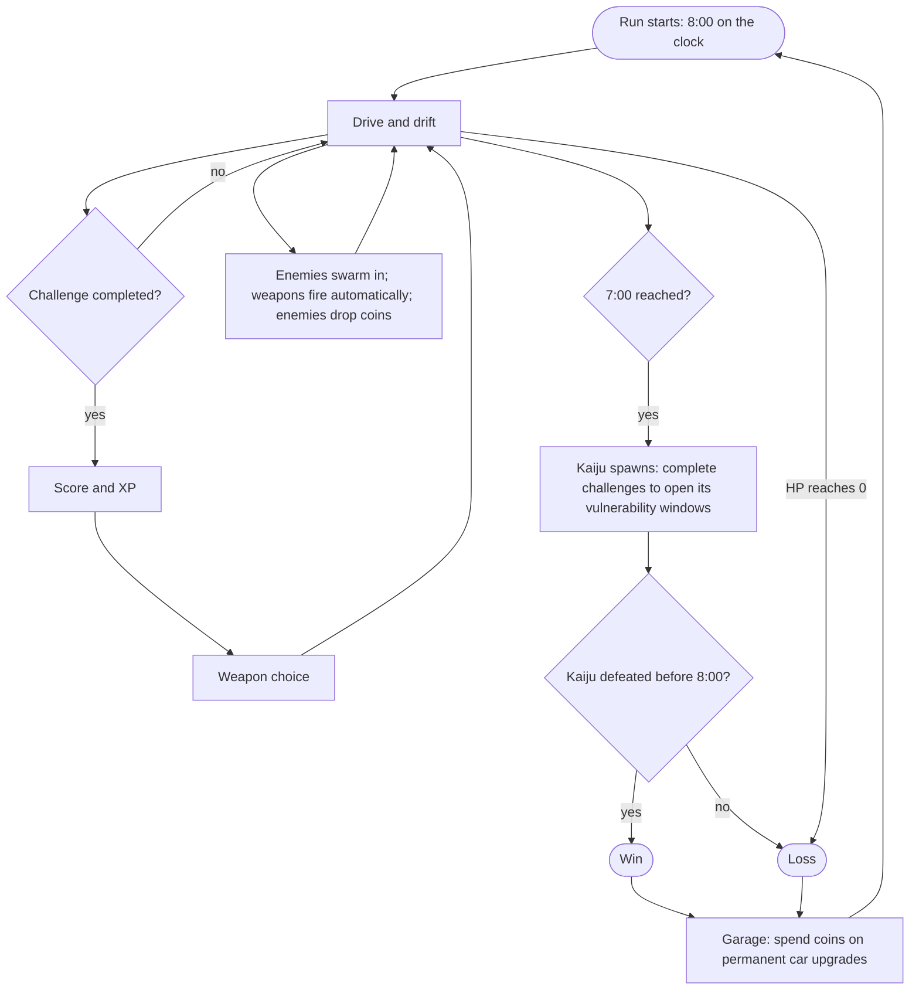

# Game loop architecture

## Summary

Solid Carbide is played in 8-minute runs. The player only drives: completing driving challenges earns XP and weapon choices, weapons fire on their own at the enemies swarming in, and enemies drop coins. At 7 minutes the kaiju arrives, and the player has the last 60 seconds to defeat it. Between runs, coins buy permanent car upgrades in the Garage, and the next run begins.

## Decisions

- A run lasts 8 minutes. (2026-10-07)
- The player only drives. The car's weapons fire automatically. (2026-10-07)
- Enemies come in from the edges of the screen, in numbers that grow over the run (how they scale: Enemies, Decisions). (2026-10-07)
- XP comes only from driving, never from kills. (2026-10-07)
- Completing a challenge flashes a score and opens a weapon choice (how many weapons are offered: Weapons, Decisions). The weapons chosen reset at the start of every run. (2026-10-07)
- Enemies drop coins. (2026-10-07)
- At the 7-minute mark the kaiju spawns. It moves slowly toward the player, deals contact damage, and can only be damaged during a window opened by completing a challenge (how: Enemies, Decisions). (2026-10-07)
- Win: defeat the kaiju within the final 60 seconds. Loss: the car's HP reaches 0 at any point, or the kaiju survives the timer. (2026-10-07)
- Between runs, coins are spent in the Garage on permanent car upgrades that improve driving in the next run. (2026-10-07)
- The final release adds local co-op for 2 players (screen split in halves) and 4 players (screen split in quarters). The MVP is single-player. (2026-10-07)

## Content

### One run

## Open questions

- Does drift time also give XP, or only completed challenges? The Final GDD's pitch mentions both; its player experience section mentions only challenges.
- Do the kaiju's own meteor challenges (Enemies, Decisions) replace the Final GDD's "challenges keep spawning near it", or do both exist?

## References

- Final GDD: [short-gdd/Solid_Carbide_-_Final_GDD.pdf](short-gdd/Solid_Carbide_-_Final_GDD.pdf), sections "Game Specificity" and "Player Experience".
