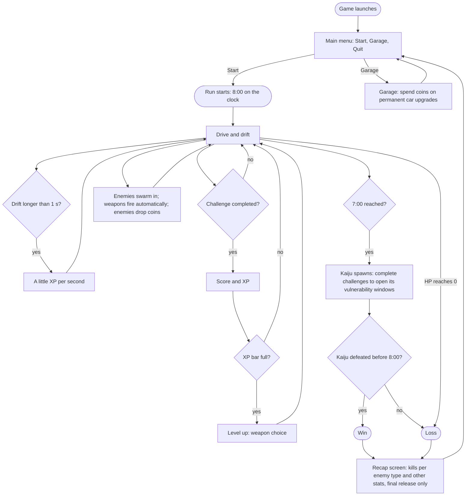

# Game loop architecture

## Summary

Solid Carbide is played in 8-minute runs. The player only drives: completing driving challenges and drifting earn XP, each level-up brings a weapon choice, weapons fire on their own at the enemies swarming in, and enemies drop coins. At 7 minutes the kaiju arrives, and the player has the last 60 seconds to defeat it. Between runs, the player is back at the main menu, where the Garage spends coins on permanent car upgrades, and Start begins the next run.

## Decisions

- A run lasts 8 minutes. (2026-10-07)
- The player only drives. The car's weapons fire automatically. (2026-10-07)
- Enemies come in from the edges of the screen, in numbers that grow over the run (how they scale: Enemies, Decisions). (2026-10-07)
- XP comes only from driving, never from kills: from completed challenges, and from drifting. (2026-10-07)
- A drift that lasts longer than 1 second gives XP for every second it lasts, the first second included (a 3-second drift gives 3 seconds' worth). (2026-10-07)
- Each second of drifting gives a fixed amount of XP: 10% of the XP bar at level 1. The amount does not grow with the bar, so at higher levels it is a smaller share of the bar and drifting gives only a little XP. (2026-10-07)
- "Drifting", for XP, uses the Unity prototype's definition: any moment W or S is held together with A or D (Unity prototype report, section 3). (2026-10-07)
- At level 1, completing one challenge fills the XP bar: the player reaches level 2 and gets the weapon choice. (2026-10-08)
- How much XP challenges and drifting give at each level, and how much XP each level needs, is worked out by the Game Data Agent as sensible XP scaling, within the decisions here. (2026-10-08)
- Completing a challenge flashes a score and gives XP. The weapon choice opens only when the XP bar fills and the player levels up (how many weapons are offered: Weapons, Decisions). The weapons chosen reset at the start of every run. (2026-10-07; weapon choice on level-up only, 2026-10-08)
- Enemies drop coins. (2026-10-07)
- At the 7-minute mark the kaiju spawns. It moves slowly toward the player, deals contact damage, and can only be damaged during a window opened by completing a challenge (how: Enemies, Decisions). (2026-10-07)
- Win: defeat the kaiju within the final 60 seconds. Loss: the car's HP reaches 0 at any point, or the kaiju survives the timer. (2026-10-07)
- Between runs, coins are spent in the Garage on permanent car upgrades that improve the car in the next run (which upgrades: Garage design, Decisions). (2026-10-07)
- The game opens on a main menu with three buttons: Start (begins a run), Garage, and Quit. When a run ends, win or loss, the player returns to the main menu. (2026-10-08)
- The final release adds a recap screen right after a run ends, win or loss: how many of each enemy type the player killed, and other stats the board will choose (task T-017). The MVP goes straight to the Garage. (2026-10-07)
- The final release adds local co-op for 2 players (screen split in halves) and 4 players (screen split in quarters). The MVP is single-player. (2026-10-07)

## Content

### One run

## Open questions

- (After MVP) Which stats does the recap screen show besides kills per enemy type, and what does it look like? (Task T-017.)

## References

- Final GDD: [short-gdd/Solid_Carbide_-_Final_GDD.pdf](short-gdd/Solid_Carbide_-_Final_GDD.pdf), sections "Game Specificity" and "Player Experience".
- Unity prototype report: [drifting/unity-prototype-report.md](drifting/unity-prototype-report.md), for the definition of drifting used for XP.
