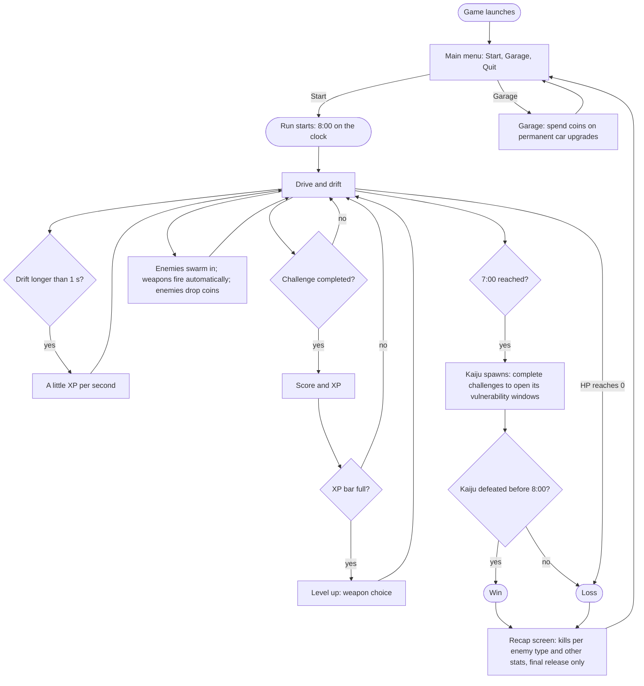
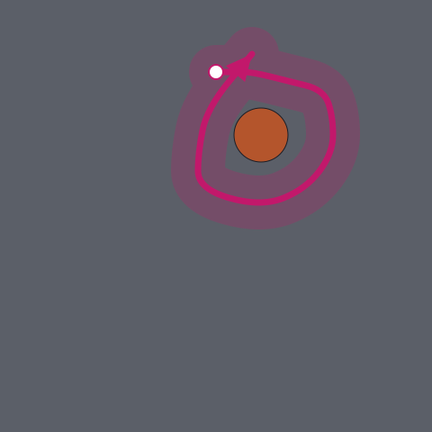
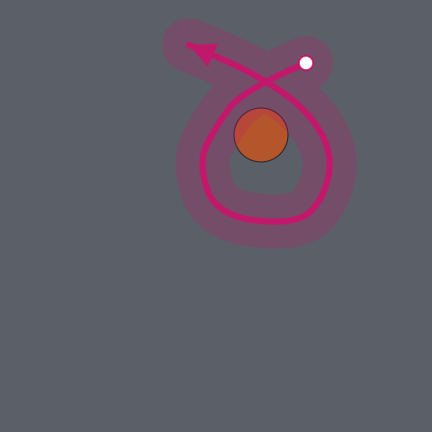
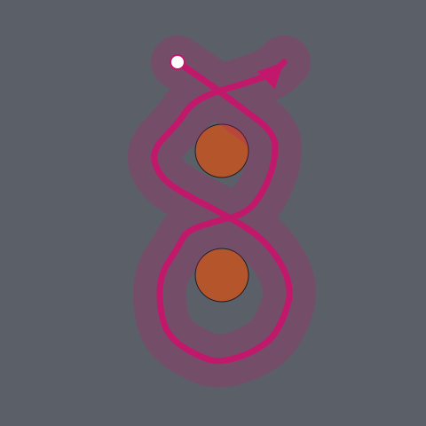
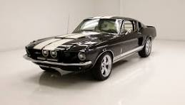
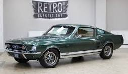
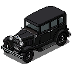

# Solid Carbide: Long GDD

The whole game design in one document, condensed from the game area docs in this folder: each chapter is one game area doc's Summary, Decisions, Content and References. Open questions stay in their own game area docs.

**Generated, do not edit by hand.** Change the game area doc instead, then regenerate with `python tools/generate_long_gdd.py`. The short GDD condenses this document (`short-gdd/`).

## Contents

1. [Game loop architecture](#1-game-loop-architecture)
2. [Drifting](#2-drifting)
3. [Level design](#3-level-design)
4. [Enemies](#4-enemies)
5. [Weapons](#5-weapons)
6. [Garage design](#6-garage-design)
7. [Visual style](#7-visual-style)
8. [Extended narrative](#8-extended-narrative)
9. [HUD and menus](#9-hud-and-menus)

## 1. Game loop architecture

*Source: [game-loop-architecture.md](game-loop-architecture.md). The overall flow of the game. Short, and reworked if the loop changes (not expected).*

Solid Carbide is played in 8-minute runs. The player only drives: completing driving challenges and drifting earn XP, each level-up brings a weapon choice, weapons fire on their own at the enemies swarming in, and enemies drop coins. At 7 minutes the kaiju arrives, and the player has the last 60 seconds to defeat it. Between runs, the player is back at the main menu, where the Garage spends coins on permanent car upgrades, and Start begins the next run.

### Decisions

- A run lasts 8 minutes.
- The player only drives. The car's weapons fire automatically.
- Enemies come in from the edges of the screen, in numbers that grow over the run (how they scale: Enemies, Decisions).
- XP comes only from driving, never from kills: from completed challenges, and from drifting.
- A drift that lasts longer than 1 second gives XP for every second it lasts, the first second included (a 3-second drift gives 3 seconds' worth).
- Each second of drifting gives a fixed amount of XP: 10% of the XP bar at level 1. The amount does not grow with the bar, so at higher levels it is a smaller share of the bar and drifting gives only a little XP.
- "Drifting", for XP, uses the Unity prototype's definition: any moment W or S is held together with A or D (Unity prototype report, section 3).
- At level 1, completing one challenge fills the XP bar: the player reaches level 2 and gets the weapon choice.
- How much XP challenges and drifting give at each level, and how much XP each level needs, is worked out by the Game Data Agent as sensible XP scaling, within the decisions here.
- Completing a challenge flashes a score and gives XP. The weapon choice opens only when the XP bar fills and the player levels up (how many weapons are offered: Weapons, Decisions). The weapons chosen reset at the start of every run.
- Enemies drop coins.
- At the 7-minute mark the kaiju spawns. It moves slowly toward the player, deals contact damage, and can only be damaged during a window opened by completing a challenge (how: Enemies, Decisions).
- Win: defeat the kaiju within the final 60 seconds. Loss: the car's HP reaches 0 at any point, or the kaiju survives the timer.
- Between runs, coins are spent in the Garage on permanent car upgrades that improve the car in the next run (which upgrades: Garage design, Decisions).
- The game opens on a main menu with three buttons: Start (begins a run), Garage, and Quit. When a run ends, win or loss, the player returns to the main menu.
- The final release adds a recap screen right after a run ends, win or loss: how many of each enemy type the player killed, and other stats the board will choose (task T-017). The MVP goes straight to the Garage.
- The final release adds local co-op for 2 players (screen split in halves) and 4 players (screen split in quarters). The MVP is single-player.

### Details

#### One run

### References

- Final GDD: [short-gdd/Solid_Carbide_-_Final_GDD.pdf](short-gdd/Solid_Carbide_-_Final_GDD.pdf), sections "Game Specificity" and "Player Experience".
- Unity prototype report: [drifting/unity-prototype-report.md](drifting/unity-prototype-report.md), for the definition of drifting used for XP.

## 2. Drifting

*Source: [drifting.md](drifting.md). How the car drives, drifts and reverses, the prototypes built so far, and the research and decisions behind them.*

Drifting is the one core skill of Solid Carbide. The car's driving and drifting copy the board's older Unity prototype, including its drift curve and its camera, and the car can also reverse. The player drives with W to go forward, S to reverse, and A and D to steer and drift.

### Decisions

- The car's driving and drifting copy the board's Unity prototype (see Content, "Prototypes so far").
- The car can reverse with the S key, as in the Unity prototype. Controls: W to go forward, S to reverse, A and D to steer and drift.
- The drift curve is the one the Unity prototype uses. This replaces the earlier plan to choose between three candidate curves (square root, linear or exponential) by playtesting. Drift is not meant to be realistic.
- The camera behaves like the Unity prototype's camera by default (how it follows the car, its zoom and any look-ahead), unless the board decides otherwise later.
- The car is drawn 3 times as long as it is wide: 1 unit wide and 3 units long. This is the drawing only: the car's physics body stays a 1 by 1 unit square, as in the Unity prototype, so collisions behave the same. The drawing sticks out past the body at the front and back.
- The car bounces off walls slightly (buildings and the map's edges), and off boulders the same way.
- Settling the movement mechanics is one of the project's top priorities and the first thing to work on.
- When W makes the car jump instantly to cruise speed, a short "boost" effect plays to emphasise the jump.
- The reference feel is the Unity prototype on its Grass stage, the only stage the board played. Grass has no off-road slowdown, so the Isometric stage's off-road damping is not part of the reference.
- The camera zoom is fixed: players cannot change it. The board picks the value by playtesting the Godot car with the prototype's zoom slider (task T-010).
- The Godot car runs its physics at 50 steps per second, like the Unity prototype, so the per-step values carry over exactly. If 50 turns out not to be possible, the values are converted for 60.
- The car's physics stays flat top-down, as in the Unity prototype, and the Godot version draws it isometrically. The board will playtest whether it feels the same; if not, the game may go back to a flat top-down view.

### Details

#### Prototypes so far

The board built two drift prototypes before this project:

- **The older prototype, in Unity: the board is very happy with it.** It is at `C:\Users\andre\drift-to-survive` on the board's machine (Unity 6000.3, project name DriftSurvivors). The reference is its current state. Its driving values come from the project files (the vehicle data asset); the board's earlier pause-menu tuning is no longer read by the current code, and only the camera zoom is still a saved pause-menu setting (in the Windows registry). Its driving and drifting are the reference for Solid Carbide. It also has reverse on the S key.
- **The newer prototype: the board is not happy with how it turned out.** It is not used as a reference and will not be analysed.

A report on how driving, drifting and reverse behave in the Unity prototype, with the preparations needed to reproduce them in Godot, is done (task T-006). See References.

#### Unity prototype summary

Facts from the report (Unity prototype report, sections 1 to 7). No new decisions.

- The car is a top-down 2D physics body. Every physics step (50 per second) the code sets its velocity directly, split into speed along the nose and speed across it. No forces.
- The handling values come from the car's data asset in the project files. The current code reads no driving value from the registry; the only saved setting that still matters is the camera zoom.
- W snaps the car to a cruise speed of 11 units per second (the Unity car is 1 unit long), then speed climbs in a straight line to a top speed of 27.5. Letting go coasts down in a straight line.
- S brakes in a straight line while moving forward, snaps to 11 backwards at zero, then climbs to 27.5 backwards. W always wins over S.
- A and D rotate the car at a fixed 191.9 degrees per second at every speed, including standing still.
- The drift comes from sideways speed being kept at 98% per physics step: held W + A or W + D builds a wide slide that levels off near a 75 degree drift angle at about 34 units per second.
- A coded "drift amount" ramps from 0 to 1 in 0.08 seconds and back in 0.33 seconds. With the current car values it does not change the handling; it drives the drift effects.
- The camera is orthographic, sits exactly on the car every frame, never rotates, and has no smoothing or look-ahead. Its zoom (default 14.4, half the visible height in world units) is a saved pause-menu setting.

### References

- Unity prototype report: [drifting/unity-prototype-report.md](drifting/unity-prototype-report.md).

## 3. Level design

*Source: [level-design.md](level-design.md). What the map looks like, plus the designs for the driving challenges. The board defines the challenges geometrically or visually at first, then agents build from that.*

The MVP has one map: a city laid out as a grid of building blocks, with roads of different widths running between them. Obstacles stand on the roads in set patterns, and some of those pattern groups become driving challenges, marked by an arrow painted on the ground. A challenge is a curved corridor with a width, which gives the player room for tolerance.

### Decisions

- A challenge is defined as a curved corridor with a width, so there is room for tolerance.
- The car counts as in the challenge as long as any part of it is touching the corridor. "The car" here is the drawn car (1 by 3 units), not its smaller physics body.
- The MVP map is a city laid out as a grid: blocks of buildings, with roads running between the blocks. (How it looks: Visual style, Decisions.)
- Roads are between 5 and 10 times as wide as the player's car. A street never widens along its length; instead, some streets are wider than others, and a wide road can join a narrower one.
- Map sizes are measured in units, where 1 unit is the drawn car's width (the smaller of its two dimensions; Drifting, Decisions). It is the same unit the driving values use.
- The MVP map is 80 by 80 units: an 8-unit perimeter road on each side, around 4 blocks of 10 and 3 roads of 8 in each direction.
- A wide road, 8 units wide, runs around the whole edge of the map. The map ends in a hard stop at its edges.
- Inside the perimeter road, building blocks of 10 by 10 units are laid out in a 4 by 4 grid, separated by roads 8 units wide (3 roads in each direction).
- The centre of the map is an open square of 28 by 28 units with no blocks. Its ground is gravel, not road.
- Obstacles are placed on the roads. In the MVP the only obstacle is a crashed meteor boulder; more kinds come later.
- In the MVP, obstacles are circles, all 3 units across (one car length), so they never block a road.
- In the MVP, a challenge includes up to 2 obstacles.
- Each challenge's arrow path is shaped to its obstacles, using scripts from the Driving & Drift Agent that show what the car can actually drive and how it behaves.
- Some obstacles are on the map from the start; others appear during the run, dropped by the boss (Enemies, Decisions).
- The obstacles on the map from the start are placed in set patterns, called obstacle pattern groups. The board defines the patterns.
- The MVP has 2 obstacle patterns, each drawn by the board (Content, "MVP challenges"):
  - **Single Boulder:** 1 boulder, with 2 possible challenges: one loop clockwise and one counter-clockwise around it.
  - **Two Boulders:** 2 boulders, with 1 possible challenge: a figure-eight around both.
- A pattern can have several possible challenges: each challenge is a different arrow path around the same obstacles.
- For the MVP, the board does no level design itself. The Level/Challenge Design Agent makes the map once, following the rules in this document and the board's descriptions and drawings, and every run uses that same map.
- 30% of the obstacle pattern groups on the map become challenges. Each challenge gets an arrow that appears under it, animated as if painted on the ground, showing the player how to drive the challenge. The arrow's animation is designed in advance.
- Which pattern groups are challenges is set in advance, the same every run. The Level/Challenge Design Agent makes the first choice, and the board adjusts it if needed.
- The painted arrow marks the challenge's corridor (the corridor in the first Decision). The arrow is as wide as the car is long (3 units), so the player doesn't have to follow its centre line exactly: the car only has to touch the arrow. The Driving & Drift Agent's scripts make sure each path is drivable.
- The Level/Challenge Design Agent decides how many copies of each pattern are placed on the map, and where.
- A challenge is completed when the drawn car touches its corridor continuously from the arrow's start to its end, in the arrow's direction. Leaving the corridor midway means starting again from the start.
- When a challenge is completed, its arrow disappears and the player gets XP on the XP bar. The group's boulders stay on the map as plain obstacles for the rest of the run.
- When a pattern with several possible arrows becomes a challenge, the Level/Challenge Design Agent picks one of its arrows.
- The board draws each challenge as its own drawing in Crash City Grid (References): one drawing per arrow path, kept in a folder per obstacle pattern. Every drawing in a pattern's folder has the same boulders; only the arrow differs.
- The board's drawings are rough sketches of each challenge's general shape, not exact layouts. The Level/Challenge Design Agent makes them fit the map (for example the 8-unit roads), with whatever reasonable adjustments that needs (size, spacing, how tight the loops are), while keeping the shape: how many boulders, which way the arrow goes around each one, and the overall path (a loop, a figure-eight). The Driving & Drift Agent's check confirms the fitted versions can be driven.

### Details

#### MVP challenges

The board's sketches of the 3 MVP challenges, one per arrow path. They show the general shape only; the fitted versions on the map are the Level/Challenge Design Agent's (Decisions). Each drawing's data (boulders and arrow points, in units from the sheet's centre) is in a `.json` file next to its picture. The pale band is the 3-unit corridor, the white dot is the start, and the arrowhead is the finish.

| Pattern | Challenge | How the arrow goes |
|---|---|---|
| Single Boulder | [arrow 1](level-design/single-boulder/arrow-1.svg) | One loop around the boulder, clockwise |
| Single Boulder | [arrow 2](level-design/single-boulder/arrow-2.svg) | One loop around the boulder, counter-clockwise |
| Two Boulders | [arrow 1](level-design/two-boulders/arrow-1.svg) | A figure-eight: clockwise around the top boulder, counter-clockwise around the bottom one |

### References

- The board's challenge drawings: `docs/level-design/` (Content, "MVP challenges"). They are exported from Crash City Grid with `python tools/export_challenge_drawings.py <folder of downloaded drawings>`.
- Crash City Grid, the map editor the board and the Project Lead draw the map in: https://claude.ai/artifact/R9AUtdNttfHKNgeqGDCPAH (private to the board). Each map is saved as an 80 by 80 grid of cells, plus its boulders, pattern groups, challenges and arrow paths, in units from the map centre; the Project Lead reads it and copies what the Level/Challenge Design Agent needs into its tasks.

## 4. Enemies

*Source: [enemies.md](enemies.md). Which enemies exist, what they look like, how they move, deal damage and behave, including the boss.*

Each level ends with its own final boss; in the first level, Crash City, it is the kaiju. The MVP boss is a huge, slow sprite that walks toward the player and deals contact damage. Its one special move rains meteors that become obstacles laid out as a challenge, and completing those challenges is the only way to make the boss vulnerable.

### Decisions

- Each level ends with a different type of monster as its final boss. The kaiju is only the first level's boss.
- MVP boss: a sprite much bigger than the player, walking slowly toward the player, with contact damage.
- The boss has one special move. After a short animation, several meteors rain down at once. In 2D, each is a meteor sprite falling top to bottom, with an impact animation on landing.
- Before the meteors land, a danger warning area shows on the ground for 2 seconds. A meteor that lands on the player deals damage and knocks them back.
- Landed meteors become obstacles, laid out as one of the challenge designs (for example, two meteors). Once they land, a guide arrow appears between them, for example a curved figure-eight, to show this is the challenge to complete.
- The boss becomes vulnerable only by completing the challenges its own meteors create. Those use a different color than the challenges already on the map.
- Over a run, the number of enemies grows slightly. Enemies do not get tougher.
- The kaiju's meteor challenges are the only challenges that make it vulnerable. They replace the Final GDD's plan of challenges spawning near the kaiju.
- The MVP minion walks on four legs towards the player (how it looks: Visual style, Decisions). Its health, contact damage and knockback are balancing numbers for the Game Data Agent; it does not copy a Unity prototype enemy.
- While the kaiju can't be hurt, it shows a shield; completing one of its meteor challenges removes the shield for the vulnerability window (how it looks: Visual style, Decisions).
- The kaiju's health is set so that it takes about 4 vulnerability windows to kill it; the Game Data Agent turns that into a number, together with the player's weapon damage.
- The Game Data Agent, with the Enemy Behavior Agent, works out the balancing numbers: how enemy numbers grow over the 7 minutes (within "slightly"), the coin drop chance and amounts, how long the kaiju stays vulnerable after a challenge, and how often it drops meteors (including whether it can drop more while a challenge is still open). The board judges them in playtests.

## 5. Weapons

*Source: [weapons.md](weapons.md). Which weapons exist and their progression trees.*

The car's weapons fire on their own, so the player only drives. The MVP has two: a simple gun the player starts every run with, which automatically shoots at enemies in range, and a flamethrower out of the exhaust that fires only while drifting.

### Decisions

- The MVP has 2 weapons: the starting gun and the exhaust flamethrower (below). Each level-up offers a choice between them (the level-up flow below).
- The final release has around 8 to 12 weapons, and each level-up offers 3 to choose from.
- The Game Data Agent works out how weapon upgrades scale from level to level, starting from the Unity prototype's upgrade values (below).
- **Starting gun:** the player starts every run with it. It has no visible weapon on the car, only the bullets it fires. It fires only when an enemy is within range, aims automatically, and fires at set intervals.
- **Exhaust flamethrower:** fires flames out of the car's exhaust, only while the car is drifting.
- Both MVP weapons copy the behaviour of the matching weapons in the board's Unity prototype (its starting gun and its Flame Exhaust): targeting, firing, the flame's shape and what turns it on. A report on how they work there is task T-022.
- Their upgrades also copy the Unity prototype's: the same upgrade tiers and what each tier changes.
- **Level-up flow in the MVP:** each level-up offers 2 choices and the player takes 1. The player starts every run with the gun, so the first level-up offers "get the flamethrower" or "upgrade the gun"; once the player has both, each level-up offers "upgrade the gun" or "upgrade the flamethrower".

### References

- Unity prototype weapons report: `weapons/unity-weapons-report.md`, being written in task T-022 (it becomes a link once it exists).

## 6. Garage design

*Source: [garage-design.md](garage-design.md). The garage's visual UI style, persistent car upgrades, the current car stats display, and future scope for unlockable cars with different driving styles.*

The garage is where coins earned in runs buy permanent upgrades for the car. It is opened from the main menu. In the MVP it sells three upgrades, each with about 10 levels: acceleration, car HP, and a damage bonus for the car's weapons, shown as a plain list.

### Decisions

- The garage is opened from the main menu (how the menus connect: Game loop architecture, Decisions).
- The MVP garage sells three permanent upgrades: **acceleration** (reaching top speed faster), **car HP**, and a **damage bonus** in percent for the car's weapons.
- Each upgrade has about 10 levels. The Game Data Agent works out each level's price and how much it improves.
- In the MVP the garage screen is a plain list: each upgrade with its current level, the price of the next level and a button to buy it, plus the player's coins and a way back to the main menu. Its visual style comes after the MVP.

## 7. Visual style

*Source: [visual-style.md](visual-style.md). The visual style for generated art (pixel art, isometric). May connect to the narrative theme.*

Solid Carbide is retro-feeling 2D pixel art in a 3/4 isometric view, set at night in a neon, Tokyo-style cyberpunk city: dark navy and purple, lit by pink, cyan and Greenbull-green neon drawn into the sprites. The player drives a dark-green, Mustang-inspired car with white stripes through cracked streets, past dark boulders with glowing cracks, chased by green lizard minions and a Godzilla-style kaiju. All art follows one technical style: hard-edged pixel art at about 40 pixels per unit, with a selective dark outline, detailed shading and a limited palette.

### Decisions

- The first map's city is cyberpunk and futuristic, in a Tokyo style, with skyscrapers and modern buildings.
- All roads are asphalt.
- Obstacles are drawn as boulders (in the MVP, crashed meteor boulders; Level design, Decisions).
- When the car drives behind a building, the building turns see-through so the car stays visible.
- **Pixel-art technical style** (from the board's reference image, References): true pixel art drawn at its final size, never scaled up; hard pixel edges with no anti-aliasing and no semi-transparent pixels; transparent backgrounds; a dark, almost black **selective outline** (broken by lighter highlight pixels); **detailed shading**; **high detail**; a limited palette of about **30 colours per sprite**.
- **Scale:** about **40 pixels per unit** (1 unit = the car's width), so the car is about 120 pixels long. The car's frames are **128 by 128 pixels**. Everything else in the world (buildings, boulders, enemies, ground) is drawn at the same scale.
- **View:** a 3/4 isometric view, seeing the top and one side. The final car art is drawn for the isometric view only; the flat top-down view keeps the placeholder.
- **Palette:** a dark navy and purple night base, with pink, cyan and Greenbull-green neon accents.
- **Mood:** the game is set at night and should feel retro.
- **Glow:** drawn into the sprites themselves, as bright pixels with small, stepped halos of darker shades. No smooth blur or bloom effects from the engine, which keeps the retro pixel look.
- **Real-world references are inspiration only:** generated art never shows real brand logos or badges (for example no Ford or Shelby badges), and creatures are never exact copies of existing characters (the kaiju is Godzilla-style, not Godzilla).
- **The car:** inspired by a 1967 Ford Mustang fastback, in dark green, with two parallel white racing stripes running down its middle (bonnet, roof and boot). See the reference photos in References.
- **Buildings:** Tokyo-style towers with vertical signs, lit windows, and satirical Greenbull billboards.
- **Ground:** asphalt roads with lane lines and crossings, cracked by the disaster; the centre is dusty gravel.
- **Boulders:** dark rock with glowing cracks.
- **Challenge arrow:** a glowing painted arrow that draws itself along the path, pulses while the challenge is open, and fades when it is completed. Arrows of the challenges on the map are **blue**; arrows of the challenges the kaiju's meteors create are **green**.
- **See-through rule:** the no-semi-transparent-pixels rule covers the pixels inside each sprite. The game itself may fade a whole object, such as the kaiju's shield or a building the car drives behind.
- **Kaiju shield:** while the kaiju can't be hurt, it is surrounded by a **green, see-through, oval shield**, the same green as its challenges' arrows. When one of those challenges is completed, the shield disappears and the kaiju shows its normal look while it can be hurt.
- **Effects** (gun bullets, exhaust flames, enemy hits and deaths, burning, coins, car damage, drift smoke and tire tracks, challenge completed, level-up): designed by the Asset Generation Agent within the palette, glow and pixel style above.
- **The kaiju's meteor attack:** a red warning circle on the ground, then a falling meteor and a burst of dust on impact.
- **The kaiju:** a giant monster several times the car's size, in the style of Godzilla.
- **The minion:** light green (not too bright), scaled lizards that walk on four legs towards the player.
- The car is drawn in 16 directions, 22.5 degrees apart, 3 times as long as it is wide (size: Drifting, Decisions).
- Until the final pixel art exists, the car uses simple placeholder sprites: plain 3:1 rectangles with a distinct nose, drawn by a script rather than generated with PixelLab, in a flat top-down set and an isometric set.

### References

- Car look references (a 1967 Ford Mustang fastback):  for the two stripes down the middle, and  for the colour.
- Technical style reference (only for the technical specs above; not the actual car, colours or mood):  `visual-style/reference-car-technical-style.png`, 128 by 128 pixels, 29 colours.

## 8. Extended narrative

*Source: [extended-narrative.md](extended-narrative.md). The deeper story context and the game's tone. Most of it is never shown to players, but it puts the game on the rails, justifies future features in the plot, and sets the voice of every user-facing text and graphic.*

The player is Stunt Driver, sent by the energy-drink brand Greenbull to cities hit by humanitarian crises and disasters, just to drift for the cameras. Every run is livestreamed to Greenbull's audience: good driving earns likes, and likes earn gift packs. The tone is satirical and tongue-in-cheek: Greenbull isn't evil, just completely out of touch, and the player should sense that their fun is slightly unethical. Each city is a level with its own monster boss; the first is Crash City and its kaiju.

### Decisions

- This document changes rarely. It puts the game on the rails: it decides what can be developed in future and how the plot justifies it, so it may hold details that only become useful later.
- Agents read it before producing any user-facing text or graphics, together with Visual style for graphics (how tasks enforce this: `tasks/README.md`).
- Overarching plot: humanitarian crises are happening around the world. Greenbull sends the player to each affected city, and each city is a new level.
- Each level's final boss is a different type of monster. The kaiju is the first level's boss, in Crash City.
- The player is **Stunt Driver**, a stunt driver sponsored by the energy-drink brand **Greenbull**, sent into each disaster just to drift and show off.
- **Tone:** satirical, ironic and tongue-in-cheek. It makes fun of soulless corporate language, social media and brand obsession. Greenbull is not evil, just completely out of touch and focused on profit. Playing is fun, but the player should sense that what they are doing is slightly unethical, and the game highlights this whenever it can.
- Every run is **livestreamed** to Greenbull's audience. Completing challenges earns **likes**.
- **Likes are XP.** Players only ever see "likes", never "XP"; the board and the agents may say XP internally. Each level threshold is a likes threshold, and filling the likes bar earns a **gift pack**: the weapon reward on level-up.
- **Greenbull funds the car's upgrades** between runs, all in service of the sponsorship.
- Weapon names, the level-up wording, descriptions and other user-facing text are written by the Narrative Theme Agent, using this document to get the tone; the board doesn't define them. That agent also chooses how likes are shown (the word, a heart icon, or both).

### References

- Final GDD: [short-gdd/Solid_Carbide_-_Final_GDD.pdf](short-gdd/Solid_Carbide_-_Final_GDD.pdf), section "Narrative Theme".

## 9. HUD and menus

*Source: [hud-and-menus.md](hud-and-menus.md). What the player sees on screen during a run (the HUD) and the menus around it: pause, level-up and their look. Which screens exist and how they connect is in Game loop architecture.*

During a run the HUD shows the car's HP, a timer counting down from 8:00, the XP bar and level, the coins collected, an arrow pointing to the nearest challenge, and the kaiju's health once it appears. Levelling up pauses the game and shows the weapon choice as simple cards. Escape pauses the game. In the MVP every screen is kept plain; their visual style comes after the MVP.

### Decisions

- During a run, the HUD shows: the car's HP as a bar; the run timer, counting down from 8:00; the XP bar, shown to the player as a likes bar (Extended narrative, Decisions), and the current level; the coins collected this run; an arrow near the car pointing to the nearest challenge; and the kaiju's health once it appears.
- When the player levels up, the game pauses and the level-up screen shows the options (what is offered: Weapons, Decisions). Each option has a title and a description. In the MVP it is kept simple: plain cards, each with a button to take it.
- The UI Agent proposes a first layout for where each HUD element goes on screen, and the board adjusts it in playtest.
- The main menu shows the title "SOLID CARBIDE" in big letters, with a discreet "(work in progress)" underneath.
- Escape pauses the game. In the MVP the pause screen only says "Paused", with a hint that Escape resumes. A full pause menu, with settings, comes in the final release.

### References

- The screens and how they connect (main menu, run, garage): Game loop architecture, Decisions.
- The garage screen: Garage design, Decisions.

## Source fingerprints

Used by `python tools/generate_long_gdd.py --check` to tell which game area docs changed since this file was generated.

| Game area doc | SHA-256 |
|---|---|
| `game-loop-architecture.md` | `51860a29dba2ab320438c47efac794b1ac35712785d566f1e4fc882c58ae7c49` |
| `drifting.md` | `58e894f9f8e87ba9c5eaf7841438c55a5ee88669e2361531e856d4b9cfdff1db` |
| `level-design.md` | `5fe14b544c7565a7ba44b8ea1e5094beb0cceaaccd9391124f1840848129f712` |
| `enemies.md` | `f54ff2705fcc7d744fd9c2092fb5817402adc42a5a6ee6c5787d07b86b2d5a72` |
| `weapons.md` | `b0b46ed322a604e43a9cf08d30079301606c3bd6df5502302bfcdb1a59e06a97` |
| `garage-design.md` | `3160f6f73ef8735a68e50c6706f2f8182dd630654d90b1d353125a2d8dd1cc0d` |
| `visual-style.md` | `e06af9c66d8ad5d004ee3e3678892fb7cd7088cb8e1f221c27166ecc6f655900` |
| `extended-narrative.md` | `311dc6ef3946cd8c8281ced726d02c71a9c2f0062a66016448f88d2aa26ab609` |
| `hud-and-menus.md` | `6e31c45f4944fce5336f16fa6fc174f4ce53e81c872f26cf75b512dcf889f1da` |
