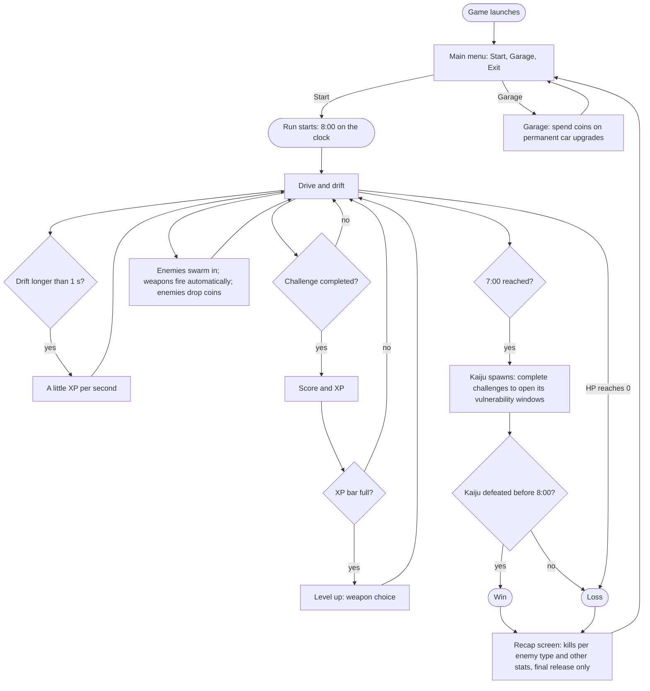

# Solid Carbide: Long GDD

The whole game design in one document, condensed from the game area docs in this folder: each chapter is one game area doc's Summary, Decisions, Content and References. Open questions stay in their own game area docs.

**Generated, do not edit by hand.** Change the game area doc instead, then regenerate with `python tools/generate_long_gdd.py`. The short GDD condenses this document (`short-gdd/`).

## Contents

1. [Game loop architecture](#1-game-loop-architecture)
2. [Drifting](#2-drifting)
3. [Level design](#3-level-design)
4. [Enemies](#4-enemies)
5. [Weapons](#5-weapons)
6. [Garage design](#6-garage-design)
7. [Visual style](#7-visual-style)
8. [Extended narrative](#8-extended-narrative)
9. [HUD and menus](#9-hud-and-menus)

## 1. Game loop architecture

*Source: [game-loop-architecture.md](game-loop-architecture.md). The overall flow of the game. Short, and reworked if the loop changes (not expected).*

Solid Carbide is played in 8-minute runs. The player only drives: completing driving challenges and drifting earn XP, each level-up brings a weapon choice, weapons fire on their own at the enemies swarming in, and enemies drop coins. At 7 minutes the kaiju arrives, and the player has the last 60 seconds to defeat it. Between runs, the player is back at the main menu, where the Garage spends coins on permanent car upgrades, and Start begins the next run.

### Decisions

- A run lasts 8 minutes.
- The player only drives. The car's weapons fire automatically.
- Enemies come in from the edges of the screen, in numbers that grow over the run (how they scale: Enemies, Decisions).
- XP comes only from driving, never from kills: from completed challenges, and from drifting.
- **Combo:** tricks (Drifting, Decisions) raise a combo multiplier, and the multiplier multiplies all XP gained (from challenges and from drifting). Each trick adds to the multiplier: extended drifts a little, a 360 more, an alternate drift the most. Colliding with anything, enemies included, cuts the combo by 80%. If no trick follows within 2 seconds, the combo drains away quickly. The Game Data Agent proposes the numbers; the board judges them in playtests. The XP from drifting seconds stays as it is, alongside the extended-drift trick. Part of the MVP.
- The higher the combo, the more enemies spawn (how: Enemies, Decisions). The board will judge in playtests whether to keep this.
- A drift that lasts longer than 1 second gives XP for every second it lasts, the first second included (a 3-second drift gives 3 seconds' worth).
- Each second of drifting gives a fixed amount of XP: 10% of the XP bar at level 1. The amount does not grow with the bar, so at higher levels it is a smaller share of the bar and drifting gives only a little XP.
- "Drifting", for XP, uses the Unity prototype's definition: any moment W or S is held together with A or D (Unity prototype report, section 3).
- At level 1, completing one challenge fills the XP bar: the player reaches level 2 and gets the weapon choice.
- How much XP challenges and drifting give at each level, and how much XP each level needs, is worked out by the Game Data Agent as sensible XP scaling, within the decisions here.
- Completing a challenge flashes a score, the likes it gave, and gives XP. The weapon choice opens only when the XP bar fills and the player levels up (how many weapons are offered: Weapons, Decisions). The weapons chosen reset at the start of every run.
- Enemies drop coins. The coins collected in a run are kept whether the run is won or lost.
- At the 7-minute mark the kaiju spawns. It moves slowly toward the player, deals contact damage, and can only be damaged during a window opened by completing a challenge (how: Enemies, Decisions).
- Win: defeat the kaiju within the final 60 seconds. Loss: the car's HP reaches 0 at any point, or the kaiju survives the timer.
- Between runs, coins are spent in the Garage on permanent car upgrades that improve the car in the next run (which upgrades: Garage design, Decisions).
- The game opens on a main menu with three buttons: Start (begins a run), Garage, and Exit. When a run ends, win or loss, the player returns straight to the main menu, with no win or loss message in the MVP.
- The final release adds a recap screen right after a run ends, win or loss: how many of each enemy type the player killed, and other stats the board will choose (task T-017). In the MVP there is no recap: the run ends at the main menu.
- The final release adds local co-op for 2 players (screen split in halves) and 4 players (screen split in quarters). The MVP is single-player.

### Content

#### One run

```mermaid
flowchart TD
    launch([Game launches]) --> menu
    start([Run starts: 8:00 on the clock]) --> drive[Drive and drift]
    drive --> drift{Drift longer than 1 s?}
    drift -- yes --> dxp[A little XP per second] --> drive
    drive --> challenge{Challenge completed?}
    challenge -- yes --> xp[Score and XP] --> lvl{XP bar full?}
    lvl -- yes --> choice[Level up: weapon choice] --> drive
    lvl -- no --> drive
    challenge -- no --> drive
    drive --> enemies[Enemies swarm in; weapons fire automatically; enemies drop coins] --> drive
    drive --> boss{7:00 reached?}
    boss -- yes --> kaiju[Kaiju spawns: complete challenges to open its vulnerability windows]
    kaiju --> win{Kaiju defeated before 8:00?}
    win -- yes --> won([Win])
    win -- no --> lost([Loss])
    drive -- HP reaches 0 --> lost
    won --> recap[Recap screen: kills per enemy type and other stats, final release only]
    lost --> recap
    recap --> menu[Main menu: Start, Garage, Exit]
    menu -- Garage --> garage[Garage: spend coins on permanent car upgrades] --> menu
    menu -- Start --> start
```

### References

- Final GDD (historical; superseded by the game area docs): [short-gdd/Solid_Carbide_-_Final_GDD.pdf](short-gdd/Solid_Carbide_-_Final_GDD.pdf), sections "Game Specificity" and "Player Experience".
- Unity prototype report: [drifting/unity-prototype-report.md](drifting/unity-prototype-report.md), for the definition of drifting used for XP.
- Run numbers (XP per challenge, XP per level, drift XP, car starting health): [game/data/run.json](../game/data/run.json), read through `game/scripts/data/run_data.gd`.
- Combo numbers (what each trick adds, the cap, the collision cut, the drain, how the combo raises spawning): [game/data/combo.json](../game/data/combo.json), read through `game/scripts/data/combo_data.gd`.

## 2. Drifting

*Source: [drifting.md](drifting.md). How the car drives, drifts and reverses, the prototypes built so far, and the research and decisions behind them.*

Drifting is the one core skill of Solid Carbide. The car's driving and drifting copy the board's older Unity prototype, including its drift curve and its camera, with a higher top speed chosen after the board's playtest of the Godot version, and the car can also reverse. The player sets the camera zoom in the pause menu. The player drives with W to go forward, S to reverse, and A and D to steer and drift.

### Decisions

- The car's driving and drifting copy the board's Unity prototype (see Content, "Prototypes so far").
- The car can reverse with the S key, as in the Unity prototype. Controls: W to go forward, S to reverse, A and D to steer and drift.
- The drift curve is the one the Unity prototype uses. This replaces the earlier plan to choose between three candidate curves (square root, linear or exponential) by playtesting. Drift is not meant to be realistic.
- The camera behaves like the Unity prototype's camera by default (how it follows the car, its zoom and any look-ahead), unless the board decides otherwise later.
- The car is drawn 3 times as long as it is wide: 1 unit wide and 3 units long. This is the drawing only: the car's physics body stays a 1 by 1 unit square, as in the Unity prototype, so collisions behave the same. The drawing sticks out past the body at the front and back.
- The car bounces off walls slightly (buildings and the map's edges), and off boulders the same way.
- The car does not bounce off enemies: they only damage it.
- The MVP has three **tricks**, all done with the car's existing driving (what tricks are worth: Game loop architecture, Decisions):
  - **Extended drift:** every second of drifting counts as one low-value trick.
  - **360:** the car's heading turns a full 360 degrees in one direction during one unbroken drift; a mid-value trick. 720 degrees counts as two.
  - **Alternate drift:** drift forwards, release W while still steering, switch to S and drift backwards, then back to W, so the car draws semicircles. Each switch between a forward and a backward drift while keeping the same steering direction counts as one high-value trick. The Driving & Drift Agent proposes the timing limits; the board tunes them.
- Settling the movement mechanics is one of the project's top priorities and the first thing to work on.
- When W makes the car jump instantly to cruise speed, a short "boost" effect plays to emphasise the jump. This comes after the MVP (tasks T-008 and T-009, final release).
- The reference feel is the Unity prototype on its Grass stage, the only stage the board played. Grass has no off-road slowdown, so the Isometric stage's off-road damping is not part of the reference.
- The camera zoom is a player setting: a slider in the pause menu (HUD and menus, Decisions), with the Unity prototype's range, 6 to 20, and its default, 14.4. As in the Unity prototype, the player's choice is saved between sessions.
- The Godot car runs its physics at 50 steps per second, like the Unity prototype, so the per-step values carry over exactly. If 50 turns out not to be possible, the values are converted for 60.
- The car's physics stays flat top-down, as in the Unity prototype, and the Godot version draws it isometrically.
- The board playtested the Godot drift prototype in the isometric view and is very happy with it. The game uses the isometric view and the Unity values, with two changes: the top speed is **3.0 times** cruise speed (Unity: 2.5), and **physics interpolation is on**, for smoother motion between physics steps. The jump to cruise speed stays at 11.

### Content

#### Prototypes so far

The board built two drift prototypes before this project:

- **The older prototype, in Unity: the board is very happy with it.** It is at `C:\Users\andre\drift-to-survive` on the board's machine (Unity 6000.3, project name DriftSurvivors). The reference is its current state. Its driving values come from the project files (the vehicle data asset); the board's earlier pause-menu tuning is no longer read by the current code, and only the camera zoom is still a saved pause-menu setting (in the Windows registry). Its driving and drifting are the reference for Solid Carbide. It also has reverse on the S key.
- **The newer prototype: the board is not happy with how it turned out.** It is not used as a reference and will not be analysed.

A report on how driving, drifting and reverse behave in the Unity prototype, with the preparations needed to reproduce them in Godot, is done (task T-006). See References.

#### Unity prototype summary

Facts from the report (Unity prototype report, sections 1 to 7). No new decisions.

- The car is a top-down 2D physics body. Every physics step (50 per second) the code sets its velocity directly, split into speed along the nose and speed across it. No forces.
- The handling values come from the car's data asset in the project files. The current code reads no driving value from the registry; the only saved setting that still matters is the camera zoom.
- W snaps the car to a cruise speed of 11 units per second (the Unity car is 1 unit long), then speed climbs in a straight line to a top speed of 27.5. Letting go coasts down in a straight line.
- S brakes in a straight line while moving forward, snaps to 11 backwards at zero, then climbs to 27.5 backwards. W always wins over S.
- A and D rotate the car at a fixed 191.9 degrees per second at every speed, including standing still.
- The drift comes from sideways speed being kept at 98% per physics step: held W + A or W + D builds a wide slide that levels off near a 75 degree drift angle at about 34 units per second.
- A coded "drift amount" ramps from 0 to 1 in 0.08 seconds and back in 0.33 seconds. With the current car values it does not change the handling; it drives the drift effects.
- The camera is orthographic, sits exactly on the car every frame, never rotates, and has no smoothing or look-ahead. Its zoom (default 14.4, half the visible height in world units) is a saved pause-menu setting.

#### Godot drift prototype

The Godot copy of the Unity car (task T-012), for the board's playtest.

- **Where:** the scene `game/scenes/drift_prototype/drift_prototype.tscn`, the project's main scene, with its code in `game/scripts/driving/`. How it is built, its keys and how to run it: `game/README.md`, "Drift prototype".
- **How to run it:** open `game/` in Godot 4.6 and press F5, or run `"$GODOT_BIN" --path game` from the repo root.
- **Controls:** W, S, A and D as in the Unity prototype (Unity prototype report, section 2). Tab opens the tuning panel, V switches the view. No jump, arrow keys or gamepad.
- **Ground:** flat and empty, like the Unity Grass stage, with a grid (a thin line every unit, a stronger one every 5 units) and a marker at the start point.
- **Movement:** the Unity prototype report's section 4, step by step, at 50 physics steps per second, with the Unity values (report, section 5). The GUT tests check it against the report's numbers. One difference: the comparison that decides whether W snaps to cruise speed (and S to reverse cruise speed) ignores rounding errors below 0.000000001 units per second. Without it, at some headings the forward speed reads back a hair under cruise speed and W would snap to cruise speed on every step instead of climbing to top speed.
- **Boost signal:** the car signals each time W makes it jump up to cruise speed, with the speed before the jump and whether W was just pressed. During a held W + A or W + D drift the slide pulls the forward speed under cruise speed, so the jump happens on most steps of the drift too (with W not just pressed).
- **Scale and camera:** 16 pixels per unit, the scale of the placeholder car sheets. The camera sits exactly on the drawn car, never rotates and has no smoothing or look-ahead. Its zoom is Unity's orthographic size, half the visible height in units.
- **View switch:** the physics always runs in the flat top-down world. V, or the panel's "Isometric view" toggle, switches only the drawing: flat top-down with the flat placeholder sheet, or a standard 2:1 isometric projection (screen = (x - y, (x + y) / 2)) of the same world with the isometric sheet. It can be switched mid-drive; the car's position, speed and rotation do not change.
- **Tuning panel (Tab):** one slider per setting in the report's section 8 list except off-road damping and the physics rate (cruise speed, top speed multiplier, time to top speed, coast slowdown, turn speed, steering sensitivity, base sideways grip, drift grip at low and high speed, drift speed reference, drift enter and exit rates), plus the camera zoom (6 to 20, starting at 14.4). Each slider starts at the Unity value, applies live and has a tooltip. One button resets everything to the Unity values. A "Physics interpolation" toggle (off, as in Unity) smooths the motion between physics steps. A readout shows speed, drift angle and drift amount. Nothing is saved between runs.

### References

- Unity prototype report: [drifting/unity-prototype-report.md](drifting/unity-prototype-report.md).
- Godot drift prototype: [../game/README.md](../game/README.md), section "Drift prototype".

## 3. Level design

*Source: [level-design.md](level-design.md). What the map looks like, plus the designs for the driving challenges. The board defines the challenges geometrically or visually at first, then agents build from that.*

The MVP has one map: a city laid out as a grid of building blocks, with roads of different widths running between them. Obstacles stand on the roads in set patterns, and some of those pattern groups become driving challenges, marked by an arrow painted on the ground. A challenge is a curved corridor with a width, which gives the player room for tolerance.

### Decisions

- A challenge is defined as a curved corridor with a width, so there is room for tolerance.
- The car counts as in the challenge as long as any part of it is touching the corridor. "The car" here is the drawn car (1 by 3 units), not its smaller physics body.
- The MVP map is a city laid out as a grid: blocks of buildings, with roads running between the blocks. (How it looks: Visual style, Decisions.)
- Roads are between 5 and 10 times as wide as the player's car. A street never widens along its length; instead, some streets are wider than others, and a wide road can join a narrower one.
- Map sizes are measured in units, where 1 unit is the drawn car's width (the smaller of its two dimensions; Drifting, Decisions). It is the same unit the driving values use.
- The MVP map is 80 by 80 units: an 8-unit perimeter road on each side, around 4 blocks of 10 and 3 roads of 8 in each direction.
- A wide road, 8 units wide, runs around the whole edge of the map. The map ends in a hard stop at its edges.
- Inside the perimeter road, building blocks of 10 by 10 units are laid out in a 4 by 4 grid, separated by roads 8 units wide (3 roads in each direction).
- The centre of the map is an open square of 28 by 28 units with no blocks. Its ground is gravel, not road.
- Obstacles are placed on the roads. In the MVP the only obstacle is a crashed meteor boulder; more kinds come later.
- In the MVP, obstacles are circles, all 3 units across (one car length), so they never block a road.
- In the MVP, a challenge includes up to 2 obstacles.
- Each challenge's arrow path is shaped to its obstacles, using scripts from the Driving & Drift Agent that show what the car can actually drive and how it behaves.
- Some obstacles are on the map from the start; others appear during the run, dropped by the boss (Enemies, Decisions).
- The obstacles on the map from the start are placed in set patterns, called obstacle pattern groups. The board defines the patterns.
- The MVP has 2 obstacle patterns, each drawn by the board (Content, "MVP challenges"):
  - **Single Boulder:** 1 boulder, with 2 possible challenges: one loop clockwise and one counter-clockwise around it.
  - **Two Boulders:** 2 boulders, with 1 possible challenge: a figure-eight around both.
- A pattern can have several possible challenges: each challenge is a different arrow path around the same obstacles.
- For the MVP, the board does no level design itself. The Level/Challenge Design Agent makes the map once, following the rules in this document and the board's descriptions and drawings, and every run uses that same map.
- 30% of the obstacle pattern groups on the map become challenges. Each challenge gets an arrow that appears under it, animated as if painted on the ground, showing the player how to drive the challenge. The arrow's animation is designed in advance.
- Which pattern groups are challenges is set in advance, the same every run. The Level/Challenge Design Agent makes the first choice, and the board adjusts it if needed.
- The painted arrow marks the challenge's corridor (the corridor in the first Decision). The arrow is as wide as the car is long (3 units), so the player doesn't have to follow its centre line exactly: the car only has to touch the arrow. The Driving & Drift Agent's scripts make sure each path is drivable.
- The Level/Challenge Design Agent decides how many copies of each pattern are placed on the map, and where.
- A challenge is completed when the drawn car touches its corridor continuously from the arrow's start to its end, in the arrow's direction. Leaving the corridor midway means starting again from the start.
- When a challenge is completed, its arrow disappears and the player gets XP on the XP bar. The group's boulders stay on the map as plain obstacles for the rest of the run.
- When a pattern with several possible arrows becomes a challenge, the Level/Challenge Design Agent picks one of its arrows.
- The board draws each challenge as its own drawing in Crash City Grid (References): one drawing per arrow path, kept in a folder per obstacle pattern. Every drawing in a pattern's folder has the same boulders; only the arrow differs.
- The board's drawings are rough sketches of each challenge's general shape, not exact layouts. The Level/Challenge Design Agent makes them fit the map (for example the 8-unit roads), with whatever reasonable adjustments that needs (size, spacing, how tight the loops are), while keeping the shape: how many boulders, which way the arrow goes around each one, and the overall path (a loop, a figure-eight). The Driving & Drift Agent's check confirms the fitted versions can be driven.

### Content

#### MVP challenges

The board's sketches of the 3 MVP challenges, one per arrow path. They show the general shape only; the fitted versions on the map are the Level/Challenge Design Agent's (Decisions). Each drawing's data (boulders and arrow points, in units from the sheet's centre) is in a `.json` file next to its picture. The pale band is the 3-unit corridor, the white dot is the start, and the arrowhead is the finish.

| Pattern | Challenge | How the arrow goes |
|---|---|---|
| Single Boulder | [arrow 1](level-design/single-boulder/arrow-1.svg) | One loop around the boulder, clockwise |
| Single Boulder | [arrow 2](level-design/single-boulder/arrow-2.svg) | One loop around the boulder, counter-clockwise |
| Two Boulders | [arrow 1](level-design/two-boulders/arrow-1.svg) | A figure-eight: clockwise around the top boulder, counter-clockwise around the bottom one |

#### Drivability check

The Driving & Drift Agent's drivability check (References) drove the board's sketches with the car's driving code (task T-021), both with the Unity prototype's top speed and with the board's top speed of 3.0 times cruise speed (Drifting, Decisions); the results were the same:

- Single Boulder, arrow 1: drivable: yes.
- Single Boulder, arrow 2: drivable: yes.
- Two Boulders, arrow 1: drivable: yes.

#### MVP map

The MVP map as built in Godot (task T-019), in flat placeholder colours: dark grey roads, the tan gravel centre, purple buildings, dark boulders with an orange rim, and blue challenge arrows. The art replaces the colours later.

**Coordinates.** Positions are in units from the map's centre, x to the right and y down, as in Crash City Grid, so the map runs from -40 to 40. The blocks start at -32, -14, 4 and 22 on each axis; the gravel centre runs from -14 to 14. The road crossings are at -36, -18, 0, 18 and 36 on each axis (0, 0 is in the gravel).

**Fitted patterns.** Each sketch has a fitted version next to it (`arrow-1.fitted.json` and `.svg`), made by a script from the sketch. The sketch's boulders are kept, 3 units across and as far apart as drawn, and its arrow points are moved as little as possible until the arrow's centre line stays at least 2 units from each boulder's centre (the rock's radius plus half the car's width) and the 3-unit corridor stays at least 0.25 units from every building:

| Fitted version | Made to fit | Around each boulder |
|---|---|---|
| [Single Boulder, arrow 1](level-design/single-boulder/arrow-1.fitted.svg) | A crossing of two 8-unit roads, the boulder on its centre | Clockwise, 387 degrees (sketch: 389) |
| [Single Boulder, arrow 2](level-design/single-boulder/arrow-2.fitted.svg) | A crossing of two 8-unit roads, the boulder on its centre | Counter-clockwise, 400 degrees (sketch: 431) |
| [Two Boulders, arrow 1](level-design/two-boulders/arrow-1.fitted.svg) | A straight 8-unit road, the boulders on its centre line, 7 units apart | Clockwise 408 degrees, then counter-clockwise 339 (sketch: 422 and 332) |

The figure-eight is squeezed across the road (its loops are 4.5 units wide at the centre line instead of about 8) and keeps its length along it.

**Pattern copies and challenges.** 12 copies; 30% of 12 is 3.6, rounded half up to 4 challenges. The rotation turns the fitted version clockwise on screen.

| Copy | Pattern | Centre | Rotation | Challenge |
|---|---|---|---|---|
| copy-01 | Single Boulder | -18, -18 | 0 | challenge-1, arrow 1 (clockwise) |
| copy-02 | Single Boulder | 0, -18 | 0 | |
| copy-03 | Single Boulder | 18, -18 | 0 | |
| copy-04 | Single Boulder | -18, 0 | 0 | |
| copy-05 | Single Boulder | 18, 0 | 0 | |
| copy-06 | Single Boulder | -18, 18 | 0 | |
| copy-07 | Single Boulder | 0, 18 | 0 | |
| copy-08 | Single Boulder | 18, 18 | 0 | challenge-2, arrow 2 (counter-clockwise) |
| copy-09 | Two Boulders | 0, -36 (top side of the perimeter road) | 90 | challenge-3 |
| copy-10 | Two Boulders | 36, 0 (right side) | 0 | |
| copy-11 | Two Boulders | 0, 36 (bottom side) | 90 | challenge-4 |
| copy-12 | Two Boulders | -36, 0 (left side) | 0 | |

**Completing a challenge.** The map checks the drawn car (a 3 by 1 unit rectangle on the car's position and heading) against each open challenge every physics step. A run starts when the car touches the arrow's start; it moves forward while the car keeps touching the corridor, and only along the stretch of arrow the car is on, so crossing a figure-eight or passing the start of a loop does not skip ahead. Not touching the corridor at all, even for one step, ends the run. Reaching the arrow's end completes the challenge.

**Drivability.** The fitted challenges have not yet been checked with the Driving & Drift Agent's script (task T-021). All 4 challenges need that check.

### References

- The board's challenge drawings: `docs/level-design/` (Content, "MVP challenges"). They are exported from Crash City Grid with `python tools/export_challenge_drawings.py <folder of downloaded drawings>`.
- Drivability check (task T-021): `game/tools/check_challenge.sh`, explained in `game/README.md` ("Challenge drivability check"). The lines the car drove on the board's sketches: [Single Boulder, arrow 1](level-design/single-boulder/arrow-1.driven.svg), [Single Boulder, arrow 2](level-design/single-boulder/arrow-2.driven.svg), [Two Boulders, arrow 1](level-design/two-boulders/arrow-1.driven.svg) (data in the `.driven.json` next to each).
- The MVP map's layout data (Content, "MVP map"): [../game/data/level/mvp_map.json](../game/data/level/mvp_map.json), with the buildings, ground cells, pattern copies, boulders and challenges (arrow points and centre lines) in units from the map's centre. It and the fitted patterns are made with `python game/tools/build_mvp_map.py`; how to open the map in Godot: [../game/README.md](../game/README.md), section "MVP map".
- Crash City Grid, the map editor the board and the Project Lead draw the map in: https://claude.ai/artifact/R9AUtdNttfHKNgeqGDCPAH (private to the board). Each map is saved as an 80 by 80 grid of cells, plus its boulders, pattern groups, challenges and arrow paths, in units from the map centre; the Project Lead reads it and copies what the Level/Challenge Design Agent needs into its tasks.

## 4. Enemies

*Source: [enemies.md](enemies.md). Which enemies exist, what they look like, how they move, deal damage and behave, including the boss.*

Each level ends with its own final boss; in the first level, Crash City, it is the kaiju. The MVP boss is a huge, slow sprite that walks toward the player and deals contact damage. Its one special move rains meteors that become obstacles laid out as a challenge, and completing those challenges is the only way to make the boss vulnerable.

### Decisions

- Each level ends with a different type of monster as its final boss. The kaiju is only the first level's boss.
- MVP boss: a sprite much bigger than the player, walking slowly toward the player, with contact damage.
- The boss has one special move. After a short animation, several meteors rain down at once. In 2D, each is a meteor sprite falling top to bottom, with an impact animation on landing.
- Before the meteors land, a danger warning area shows on the ground for 2 seconds. A meteor that lands on the player deals damage and knocks them back.
- Landed meteors become obstacles, laid out as one of the challenge designs (for example, two meteors). Once they land, a guide arrow appears between them, for example a curved figure-eight, to show this is the challenge to complete.
- The boss becomes vulnerable only by completing the challenges its own meteors create. Those use a different color than the challenges already on the map.
- Over a run, the number of enemies grows slightly. Enemies do not get tougher.
- The kaiju's meteor challenges are the only challenges that make it vulnerable. They replace the Final GDD's plan of challenges spawning near the kaiju.
- The MVP minion walks on four legs towards the player (how it looks: Visual style, Decisions). Its health, contact damage and knockback are balancing numbers for the Game Data Agent; it does not copy a Unity prototype enemy.
- While the kaiju can't be hurt, it shows a shield; completing one of its meteor challenges removes the shield for the vulnerability window (how it looks: Visual style, Decisions).
- The kaiju's health is set so that it takes about 4 vulnerability windows to kill it; the Game Data Agent turns that into a number, together with the player's weapon damage.
- The Game Data Agent, with the Enemy Behavior Agent, works out the balancing numbers: how enemy numbers grow over the 7 minutes (within "slightly"), the coin drop chance and amounts, how long the kaiju stays vulnerable after a challenge, and how often it drops meteors (including whether it can drop more while a challenge is still open). The board judges them in playtests.
- Where and how minions spawn, and how often their contact damage applies, are proposed by the Enemy Behavior Agent with the Game Data Agent; the board judges them in playtests. So is how many of the kaiju's meteor challenges can be open at once.
- Killing the kaiju ends the run at once, as a win.
- The higher the player's combo (Game loop architecture, Decisions), the more minions spawn, on top of the slow growth over the run. It can be switched off, so the board can judge in playtests whether to keep it; the Game Data Agent proposes how strongly the combo raises spawning.

## 5. Weapons

*Source: [weapons.md](weapons.md). Which weapons exist and their progression trees.*

The car's weapons fire on their own, so the player only drives. The MVP has two: a simple gun the player starts every run with, which automatically shoots at enemies in range, and a flamethrower out of the exhaust that fires only while drifting.

### Decisions

- The MVP has 2 weapons: the starting gun and the exhaust flamethrower (below). Each level-up offers a choice between them (the level-up flow below).
- The final release has around 8 to 12 weapons, and each level-up offers 3 to choose from.
- The Game Data Agent works out how weapon upgrades scale from level to level, starting from the Unity prototype's upgrade values (below).
- **Starting gun:** the player starts every run with it. It has no visible weapon on the car, only the bullets it fires. It fires only when an enemy is within range, aims automatically, and fires at set intervals.
- **Exhaust flamethrower:** fires flames out of the car's exhaust, only while the car is drifting.
- Both MVP weapons copy the behaviour of the matching weapons in the board's Unity prototype (its starting gun and its Flame Exhaust): targeting, firing, the flame's shape and what turns it on. A report on how they work there is task T-022.
- Their upgrades also copy the Unity prototype's: the same upgrade tiers and what each tier changes.
- **Level-up flow in the MVP:** each level-up offers 2 choices and the player takes 1. The player starts every run with the gun, so the first level-up offers "get the flamethrower" or "upgrade the gun"; once the player has both, each level-up offers "upgrade the gun" or "upgrade the flamethrower".
- A weapon at its last upgrade tier is no longer offered: the level-up offers the other weapon's next tier instead, and if both are at their last tier, the level-up is skipped and the run goes on.
- Where the Unity prototype's weapons behave in unexpected ways (Unity weapons report, section 7), the MVP copies them, with three fixes:
  - **Copied:** the flame uses the gun's damage (2), not its own (1); the bullet's hit circle stays 2 units across, larger than it is drawn; the gun looks for a target only once per firing interval; the weapons never push enemies back; the flame's steering tier makes the car steer 20% faster, compounding; the flame's tier 5 only makes the burn flash last longer; reversing while steering counts as drifting, so the flame comes on.
  - **Fixed:** damage is not rounded to whole numbers, so the flame's "hotter flame" tier always adds damage; the flame's area is the same size whichever way the car faces; a bullet that misses is removed once it has flown past the gun's range.

### Content

#### Unity prototype weapons

Facts from the Unity prototype weapons report (sections 1 to 5). No new decisions.

- The prototype's starting gun is its "Simple Gun" (`SimpleGunWeapon`, data asset `Weapon_MachineGun`): the only weapon on the car when a run starts.
- The gun checks for living enemies within 12 units of the car's centre every 1.26 seconds and fires one bullet at the closest. Bullets fly straight from the car's centre at 15 units per second, deal 2 damage, and are removed on their first hit. Bullets that miss are never removed.
- The Flame Exhaust is on while the car is drifting (W or S held with A or D) at 0.85 units per second or more, and for 0.2 seconds after. It damages enemies inside a rectangle behind the car that starts each drift at half size and reaches full size (about 2.6 wide and 3.25 deep) after 1 second of drifting.
- An enemy entering the flame takes 2 damage at once, and every enemy inside takes 2 more every 0.2 seconds. The flame takes this damage from the gun's stats; its own asset's damage (1) is not used.
- Each weapon has 8 tiers: getting it is tier 1, and each later pick applies the next of 7 upgrades. The gun gets more bullets, faster fire, a wider range and, last, bullets that pierce the first enemy. The flame gets a bigger area, more damage, a longer burn flash, faster car steering and, last, an always-on flame.
- The prototype's level-up offers 3 choices drawn at random from power-ups, new weapons and the next tiers of owned weapons. A weapon at tier 8 is no longer offered, and when nothing is left the only choice is 4 coins.
- The report lists every value with its source, the differences from Solid Carbide's level-up flow, notes on porting to Godot, and open questions for the board: [weapons/unity-weapons-report.md](weapons/unity-weapons-report.md).

### References

- Unity prototype weapons report: [weapons/unity-weapons-report.md](weapons/unity-weapons-report.md).
- Weapon numbers (base values and the 7 upgrade tiers of each weapon): [../game/data/weapons.json](../game/data/weapons.json), read through `game/scripts/data/weapon_data.gd`.

## 6. Garage design

*Source: [garage-design.md](garage-design.md). The garage's visual UI style, persistent car upgrades, the current car stats display, and future scope for unlockable cars with different driving styles.*

The garage is where coins earned in runs buy permanent upgrades for the car. It is opened from the main menu. In the MVP it sells three upgrades, each with about 10 levels: acceleration, car HP, and a damage bonus for the car's weapons, shown as a plain list.

### Decisions

- The garage is opened from the main menu (how the menus connect: Game loop architecture, Decisions).
- The MVP garage sells three permanent upgrades: **acceleration** (reaching top speed faster), **car HP**, and a **damage bonus** in percent for the car's weapons.
- Each upgrade has about 10 levels. The Game Data Agent works out each level's price and how much it improves.
- In the MVP the garage screen is a plain list: each upgrade with its current level, the price of the next level and a button to buy it, plus the player's coins and a way back to the main menu. Its visual style comes after the MVP.
- The player's coins and the upgrade levels bought are saved to disk, so they are kept between game sessions.

### References

- The upgrade prices and effects: `game/data/garage.json` (task T-056).

## 7. Visual style

*Source: [visual-style.md](visual-style.md). The visual style for generated art (pixel art, isometric). May connect to the narrative theme.*

Solid Carbide is retro-feeling 2D pixel art in a 3/4 isometric view, set at night in a neon, Tokyo-style cyberpunk city: dark navy and purple, lit by pink and cyan neon drawn into the sprites, with Redgull's red only on Redgull's own things. The player drives a dark-green, Mustang-inspired car with white stripes through cracked streets, past dark boulders with glowing cracks, chased by green lizard minions and a Godzilla-style kaiju. All art follows one technical style: hard-edged pixel art at about 40 pixels per unit, with a selective dark outline, detailed shading and a limited palette.

### Decisions

- The first map's city is cyberpunk and futuristic, in a Tokyo style, with skyscrapers and modern buildings.
- All roads are asphalt.
- Obstacles are drawn as boulders (in the MVP, crashed meteor boulders; Level design, Decisions).
- When the car drives behind a building, the building turns see-through so the car stays visible.
- How buildings turn see-through (from task T-020's research): the whole building fades while the car is behind it, to **15% visible**, over **0.15 seconds**, and fades back when the car comes out. Only buildings actually covering the car fade. In the MVP only the car is kept visible this way, not enemies or the kaiju; the board may revisit this after playtests.
- **Pixel-art technical style** (from the board's reference image, References): true pixel art drawn at its final size, never scaled up; hard pixel edges with no anti-aliasing and no semi-transparent pixels; transparent backgrounds; a dark, almost black **selective outline** (broken by lighter highlight pixels); **detailed shading**; **high detail**; a limited palette of about **30 colours per sprite**.
- **Scale:** about **40 pixels per unit** (1 unit = the car's width), so the car is about 120 pixels long. The car's frames are **128 by 128 pixels**. Everything else in the world (buildings, boulders, enemies, ground) is drawn at the same scale.
- **View:** a 3/4 isometric view, seeing the top and one side. The final car art is drawn for the isometric view only; the flat top-down view keeps the placeholder.
- **Palette:** a dark navy and purple night base, with pink and cyan neon accents. Redgull's red is not part of the city's palette; it appears only on Redgull's own things (Redgull's look, below).
- **Mood:** the game is set at night and should feel retro.
- **Glow:** drawn into the sprites themselves, as bright pixels with small, stepped halos of darker shades. No smooth blur or bloom effects from the engine, which keeps the retro pixel look.
- **Real-world references are inspiration only:** generated art never shows real brand logos or badges (for example no Ford or Shelby badges), and creatures are never exact copies of existing characters (the kaiju is Godzilla-style, not Godzilla).
- **The car:** inspired by a 1967 Ford Mustang fastback, in dark green, with two parallel white racing stripes running down its middle (bonnet, roof and boot). See the reference photos in References.
- **Buildings:** Tokyo-style towers with vertical signs and lit windows. The city has nothing to do with Redgull, so the buildings carry none of its colours or branding. After the MVP, occasional Redgull banners may be added as separate assets placed on the buildings, not drawn into them.
- **Redgull's look:** the company's logo is a simple, sketched seagull with red eyes, slightly evil and unsettling (why: Extended narrative, Decisions). Red is the company's theme colour, used only on things that belong to Redgull: its logo, its banners (after the MVP) and, in the MVP, the weapons, which arrive as Redgull gift packs. They don't have to be all red; red is included where it fits. It does not change the colour of the car, the enemies, the map or anything else.
- **Ground:** asphalt roads with lane lines and crossings, cracked by the disaster; the centre is dusty gravel.
- **Boulders:** dark rock with glowing cracks.
- **Challenge arrow:** a glowing painted arrow that draws itself along the path, pulses while the challenge is open, and fades when it is completed. Arrows of the challenges on the map are **blue**; arrows of the challenges the kaiju's meteors create are **green**.
- **See-through rule:** the no-semi-transparent-pixels rule covers the pixels inside each sprite. The game itself may fade a whole object, such as the kaiju's shield or a building the car drives behind.
- **Kaiju shield:** while the kaiju can't be hurt, it is surrounded by a **green, see-through, oval shield**, the same green as its challenges' arrows. When one of those challenges is completed, the shield disappears and the kaiju shows its normal look while it can be hurt.
- **Effects** (gun bullets, exhaust flames, enemy hits and deaths, burning, coins, car damage, drift smoke and tire tracks, challenge completed, level-up): designed by the Asset Generation Agent within the palette, glow and pixel style above.
- Art details these decisions leave open (for example how many directions and animation frames the minion and the kaiju have, or how many building and ground-tile variants there are) are proposed by the Asset Generation Agent in each art task; the board judges them.
- **The kaiju's meteor attack:** a red warning circle on the ground, then a falling meteor and a burst of dust on impact.
- **The kaiju:** a giant monster several times the car's size, in the style of Godzilla.
- **The minion:** light green (not too bright), scaled lizards that walk on four legs towards the player.
- The car is drawn in 16 directions, 22.5 degrees apart, 3 times as long as it is wide (size: Drifting, Decisions).
- Until the final pixel art exists, the car uses simple placeholder sprites: plain 3:1 rectangles with a distinct nose, drawn by a script rather than generated with PixelLab, in a flat top-down set and an isometric set.

### Content

#### See-through buildings

Task T-020 researched how buildings can turn see-through when the car is behind them: it compares three approaches and builds a demo with the recommended one (fading the whole building while the car is behind it) and a cut-out variant. The demo, the screenshots with several fade strengths and the questions for the board are in the report (References).

### References

- **Car look, colour:** a dark-green 1967 Ford Mustang fastback (inspiration only; no real badges).

  

- **Car look, stripes:** the two stripes down the middle, from a black 1967 Mustang fastback (inspiration only).

  

- **Technical style:** only for the technical specs in Decisions (128 by 128 pixels, 29 colours); not the actual car, colours or mood.

  

- **See-through buildings:** [research report, demo and screenshots (T-020)](visual-style/see-through-buildings.md).

## 8. Extended narrative

*Source: [extended-narrative.md](extended-narrative.md). The deeper story context and the game's tone. Most of it is never shown to players, but it puts the game on the rails, justifies future features in the plot, and sets the voice of every user-facing text and graphic.*

The player is Stunt Driver, sent by the energy-drink brand Redgull to cities hit by humanitarian crises and disasters, just to drift for the cameras. Every run is livestreamed to Redgull's audience: good driving earns likes, and likes earn gift packs. The tone is satirical and tongue-in-cheek: Redgull isn't evil, just completely out of touch, and the player should sense that their fun is slightly unethical. Each city is a level with its own monster boss; the first is Crash City and its kaiju.

### Decisions

- This document changes rarely. It puts the game on the rails: it decides what can be developed in future and how the plot justifies it, so it may hold details that only become useful later.
- Agents read it before producing any user-facing text or graphics, together with Visual style for graphics (how tasks enforce this: `tasks/README.md`).
- Overarching plot: humanitarian crises are happening around the world. Redgull sends the player to each affected city, and each city is a new level.
- Each level's final boss is a different type of monster. The kaiju is the first level's boss, in Crash City.
- The player is **Stunt Driver**, a stunt driver sponsored by the energy-drink brand **Redgull**, sent into each disaster just to drift and show off.
- **Tone:** satirical, ironic and tongue-in-cheek. It makes fun of soulless corporate language, social media and brand obsession. Redgull is not evil, just completely out of touch and focused on profit. Playing is fun, but the player should sense that what they are doing is slightly unethical, and the game highlights this whenever it can.
- Redgull's logo, a sketched seagull with red eyes, looks **slightly evil and unsettling** on purpose, which suits the company's role in the story (the logo's look and the company's red: Visual style, Decisions).
- Every run is **livestreamed** to Redgull's audience. Completing challenges earns **likes**.
- **Likes are XP.** Players only ever see "likes", never "XP"; the board and the agents may say XP internally. Each level threshold is a likes threshold, and filling the likes bar earns a **gift pack**: the weapon reward on level-up.
- **Redgull funds the car's upgrades** between runs, all in service of the sponsorship.
- Weapon names, the level-up wording, descriptions and other user-facing text are written by the Narrative Theme Agent, using this document to get the tone; the board doesn't define them. That agent also chooses how likes are shown (the word, a heart icon, or both).

### References

- Final GDD (historical; superseded by the game area docs): [short-gdd/Solid_Carbide_-_Final_GDD.pdf](short-gdd/Solid_Carbide_-_Final_GDD.pdf), section "Narrative Theme".

## 9. HUD and menus

*Source: [hud-and-menus.md](hud-and-menus.md). What the player sees on screen during a run (the HUD) and the menus around it: pause, level-up and their look. Which screens exist and how they connect is in Game loop architecture.*

During a run the HUD shows the car's HP, a timer counting down from 8:00, the XP bar and level, the coins collected, an arrow pointing to the nearest challenge, and the kaiju's health once it appears. Levelling up pauses the game and shows the weapon choice as simple cards. Escape pauses the game, and the pause screen has a camera zoom slider. In the MVP every screen is kept plain; their visual style comes after the MVP.

### Decisions

- During a run, the HUD shows: the car's HP as a bar; the run timer, counting down from 8:00; the XP bar, shown to the player as a likes bar (Extended narrative, Decisions), and the current level; the coins collected this run; an arrow near the car pointing to the nearest challenge; and the kaiju's health once it appears.
- When the player levels up, the game pauses and the level-up screen shows the options (what is offered: Weapons, Decisions). Each option has a title and a description. In the MVP it is kept simple: plain cards, each with a button to take it.
- The HUD shows the current combo multiplier as a counter next to the likes bar. When the player completes a trick, a short comic-style text pops out from the car with the trick's name and what it added to the multiplier (combo: Game loop architecture, Decisions). Extended-drift popups are smaller than the others, since they come every second.
- The UI Agent proposes a first layout for where each HUD element goes on screen, and the board adjusts it in playtest.
- The main menu shows the title "SOLID CARBIDE" in big letters, with a discreet "(work in progress)" underneath.
- Escape pauses the game. In the MVP the pause screen says "Paused", with a hint that Escape resumes, and has one setting: the camera zoom slider (Drifting, Decisions). A full pause menu, with more settings, comes in the final release.

### Content

#### Main menu

A plain screen (task T-054) with a dark navy background. The title "SOLID CARBIDE" is in big cyan letters, with a small grey "(work in progress)" under it. Below are three buttons in a column: Start, Garage and Exit (text approved in T-053). The menu only shows the screen: pressing a button sends the signal `start_pressed`, `garage_pressed` or `exit_pressed`, and what happens next is the screen flow (T-055). Keyboard focus starts on Start. The scene is `game/scenes/menu/main_menu.tscn`; how to open it is in `game/README.md`, "Main menu".

(The pause and level-up screens: to be written.)

### References

- The screens and how they connect (main menu, run, garage): Game loop architecture, Decisions.
- The garage screen: Garage design, Decisions.

## Source fingerprints

Used by `python tools/generate_long_gdd.py --check` to tell which game area docs changed since this file was generated.

| Game area doc | SHA-256 |
|---|---|
| `game-loop-architecture.md` | `0e58f1072f02541e71075a94dd328e1443417e4fd1560f95266f99d7bdc6d458` |
| `drifting.md` | `6e59fb1a63439006ba2cbdf113324fc5384827cdf199918475e5cc8bcba2cde0` |
| `level-design.md` | `6f73fa5d924ebf05c818659605cb63135fe781cfa280a9ce5e8a7de20bd4a0fb` |
| `enemies.md` | `2933890c1e53b6b8310617bddea00f7b319eeb5e1a3aa4abeadc8ad20583efcb` |
| `weapons.md` | `046697cd73f9af49e5c5e728a462a635ee51b5e44f3d71143fe06f2c7de51d33` |
| `garage-design.md` | `758e1a132f186a58533b9bc27810ea4567e4e38802a5e5cd256cedc8e52055b2` |
| `visual-style.md` | `620687e6e450eea0617007be696c86d4f5d68ef9b28c9ff7e9875a356cf2574b` |
| `extended-narrative.md` | `24f49796395c2b308878a2c8340564997f977c566de2df5655c7f79123895b32` |
| `hud-and-menus.md` | `2de6000c560df9811f72463dee6f58e550da1ab6f11a976733290a1845c01ea3` |
