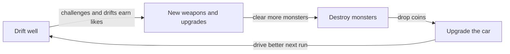
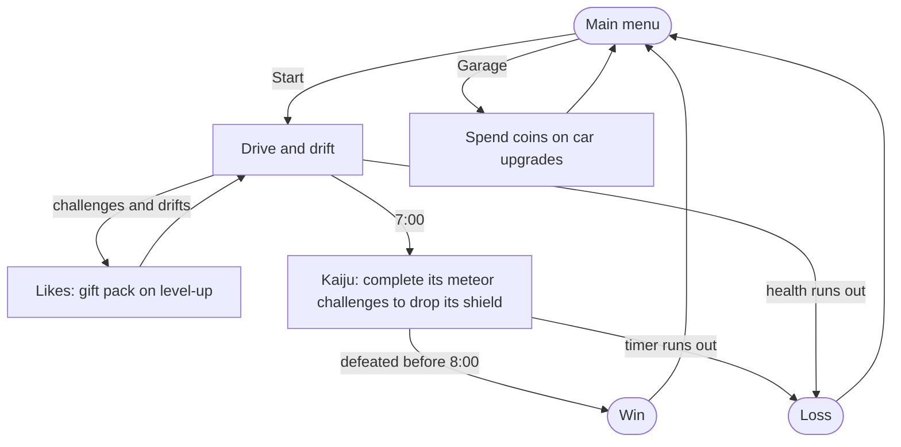

# Solid Carbide

| Genre | Platform | Playtime | Style | Engine |
|---|---|---|---|---|
| Roguelite driving-survival | PC (Windows) | 8 minutes per run | 2D isometric pixel art, retro neon cyberpunk | Godot 4 |

## Pitch

**In one sentence:** *Solid Carbide* is a driving roguelite where you survive by out-drifting monsters and pulling off driving challenges for a livestream audience that rewards you with weapons.

**In one paragraph:** Monsters have overrun Crash City, and the energy-drink brand Greenbull has sent its sponsored Stunt Driver in, not to help, but to drift for the cameras. Every run is livestreamed. Completing driving challenges and holding long drifts earns likes; filling the likes bar levels you up and Greenbull drops you a gift pack: a new weapon or an upgrade. Your weapons fire on their own, so you only ever drive. Monsters swarm in and drop coins, which buy permanent car upgrades in the garage between runs. At the 7-minute mark a Godzilla-style kaiju arrives behind a green shield, and the only way through it is to complete the challenges its own meteors create. One minute, one kaiju, one skill: drifting.

## The world and the tone

Humanitarian crises are breaking out around the world, and Greenbull sends its stunt driver to each disaster zone, one city per level. The first is Crash City and its kaiju.

The tone is **satirical and tongue-in-cheek**. Greenbull isn't evil, just completely out of touch: obsessed with its brand, its feed and its numbers. The game is fun to play, but the player should sense that what they're doing is slightly unethical, and it says so whenever it can. Players never see "XP": they see **likes**, and the rewards arrive as Greenbull **gift packs**. Greenbull also funds the car's upgrades, all in service of the sponsorship.

## Design pillars

- **Drift feel is king.** The car's handling copies a drift prototype the designer is happy with, and it is tuned by playing it before any final art exists.
- **Drive to get stronger.** Likes, and so new weapons, come only from driving: challenges and drifts. Never from kills.
- **Destroy to upgrade the car.** Monsters drop coins; coins buy permanent upgrades in the garage. Kills never give likes.

## The game

**A run lasts 8 minutes.** The player starts at the main menu (Start, Garage, Quit) and returns there after every run, win or loss.

- **Driving:** W drives forward, S brakes and reverses, A and D steer and drift. The car jumps straight to a cruising speed and builds a long, fast slide when turned, which carries more speed than driving straight.
- **Challenges:** obstacles of crashed meteor boulders stand on the roads in set patterns. 30% of these patterns are challenges, each marked by a glowing arrow painted on the ground. Follow the arrow from start to finish, staying on it, and the challenge is complete: the arrow fades and the stream sends likes. The MVP has 3 kinds: a clockwise and a counter-clockwise loop around one boulder, and a figure-eight around two.
- **Likes and gift packs:** challenges give most of the likes; drifts longer than a second add a little. Each time the likes bar fills, the game pauses for a gift pack: a choice of two weapons or upgrades. The first is always the exhaust flamethrower or a gun upgrade.
- **Weapons:** the car starts every run with a **gun** that aims and fires on its own at monsters in range. The second weapon is a **flamethrower out of the exhaust that fires only while drifting**. The weapons reset every run.
- **Monsters:** light-green, four-legged lizards come in from the edges of the screen, a few more as the run goes on. They hurt the car on contact and drop coins.
- **The kaiju:** at 7:00 a Godzilla-style kaiju arrives and walks slowly towards the car. Its green shield blocks all damage. It rains meteors (a red warning circle shows where they will land) that become new challenges with green arrows. Completing one drops the shield for a short window; about four windows are enough to bring it down.
- **Winning and losing:** defeat the kaiju before 8:00 to win. The run is lost if the car's health runs out or the kaiju survives the timer.
- **The garage:** between runs, coins buy permanent upgrades, about 10 levels each: acceleration, car health and a weapon damage bonus.

## Player experience

The player only drives; everything else reacts. The screen shows the car's health, a timer counting down from 8:00, the likes bar and level, the coins collected, an arrow pointing to the nearest challenge, and the kaiju's health once it arrives. Escape pauses the game.

The map is one city: 80 by 80 units (one unit is a car's width), laid out as a 4 by 4 grid of city blocks with roads between them, a wide road around the edge and an open gravel square in the middle. The car bounces off buildings and boulders, and buildings turn see-through when the car drives behind them.

## The look

Night in a Tokyo-style cyberpunk city: dark navy and purple, lit by pink, cyan and Greenbull-green neon, with vertical signs, lit windows and satirical Greenbull billboards over cracked asphalt. The car is a dark-green, late-sixties fastback muscle car with two white stripes. All art is hard-edged, retro pixel art in a 3/4 isometric view, with a dark outline, detailed shading, glow drawn into the pixels and no blur. Real cars and monsters are only inspiration: no real logos, no copies of existing characters.

## The MVP, and what comes after

| | MVP | After the MVP |
|---|---|---|
| Weapons | 2: the gun and the exhaust flamethrower | 8 to 12, three offered per gift pack |
| Bosses | the kaiju in Crash City | a different monster boss for each city |
| Map | one city, made once | more cities, one per level (how maps are made is still open) |
| Challenges | 3 kinds, around boulders | more obstacle kinds |
| Garage | 3 upgrades, a plain list | more upgrades, unlockable cars |
| Players | single player | local co-op for 2 or 4, split screen |
| Screens | plain menus | a run recap, a full pause menu, styled screens |

## How it's made

Solid Carbide is built by a small studio of AI agents run with Claude Code. The designer is the board, and the **Project Lead** turns the board's requests into task files and keeps the documents in sync. Ten specialist agents build the game: driving and drift, enemies, weapons, game data, the map and challenges, the UI, pixel art (generated through PixelLab), sound effects (music is made by a human), the story's tone, and QA, which checks every task before the board plays it. No AI runs inside the shipped game.

Every decision lives in one of the game area documents, the long GDD is generated from them, and this short GDD condenses the long one.
