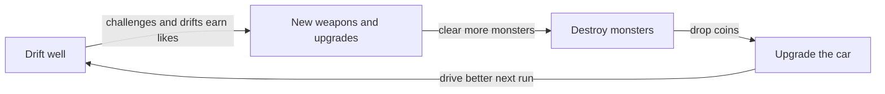

<!--
status: open | in-progress | in-qa | needs-playtest | blocked | flagged-for-review | done
qa_rounds: how many times QA has checked this task. The maximum is 2.
A task is not done until every document listed in documents_affected has been updated.
-->

## Description

**Work for the board, not for an agent.** Ideas come only from the board, so the Project Lead does not propose pillar wording here.

The board's feedback (2026-10-08): the current "Design pillars" in the short GDD read like agent instructions, not real design pillars. They need reworking into attractive, presentable pillars.

The starting point is the current section in `docs/short-gdd/short-gdd.md` (on the T-025 branch, `task/T-025-short-gdd-rewrite`):

> - **Drift feel is king.** The car's handling copies a drift prototype the designer is happy with, and it is tuned by playing it before any final art exists.
> - **Drive to get stronger.** Likes, and so new weapons, come only from driving: challenges and drifts. Never from kills.
> - **Destroy to upgrade the car.** Monsters drop coins; coins buy permanent upgrades in the garage. Kills never give likes.

**How the new pillars reach the short GDD (sync rule, CLAUDE.md).** The game area docs are the source of truth, the long GDD is generated from them, and the short GDD condenses the long GDD. Content flows down only, so the pillars are not written directly into the short GDD. Once the board has written the pillars:

1. The Project Lead records them as a decision in the game area doc that fits best, likely `docs/game-loop-architecture.md` (the Project Lead confirms the doc with the board first).
2. The Project Lead regenerates the long GDD (`python tools/generate_long_gdd.py`).
3. The Project Lead updates the short GDD's "Design pillars" section from the long GDD, re-exports the PDF (`python tools/export_short_gdd_pdf.py`) and updates the fingerprint in `docs/short-gdd/README.md`.

## Acceptance criteria

- [ ] The board's pillars are recorded in a game area doc's Decisions, with the date (Project Lead checks)
- [ ] The long GDD is regenerated and `python tools/generate_long_gdd.py --check` exits 0 (Project Lead checks)
- [ ] The short GDD's "Design pillars" section and `docs/short-gdd/short-gdd.pdf` are updated (Project Lead checks)
- [ ] The timeline records it (Project Lead checks)

## Result notes

